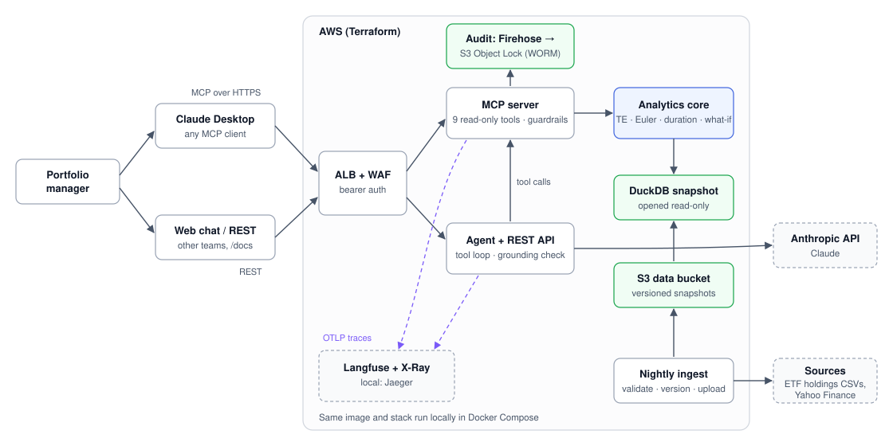

# Portfolio Intelligence

An MCP server and LLM agent that answer portfolio-manager questions such as
*"What's my active weight in European banks?"*, *"Which positions drive my tracking error?"* and
*"What happens to my TE if I trim HSBC by 50bps?"*. Every number comes from deterministic,
tested analytics, never from the model.



## Design principles

- **The LLM never does maths.** Tools return values already in display units with an explicit
  `unit` field. A post-generation grounding check flags any number in the answer that no tool
  returned, and asks the model to rewrite.
- **One analytics core, several adapters.** `analytics/` is plain Python with no knowledge of MCP,
  HTTP or LLMs. `service.py` is the single façade; the MCP server and the REST API are thin
  adapters over it.
- **Read-only by construction, not by prompt.** No tool can place an order, the database is
  opened read-only, and the what-if simulator labels every result `hypothetical: true`.
- **Everything is reproducible.** Every response carries `as_of`, `data_snapshot_id`,
  `methodology_version` and a `calc_id`. Every tool call is audited, and
  `pi-replay <event_id>` re-runs it and verifies the result hash.
- **Honest about coverage.** Securities without enough price history are excluded from the risk
  model, and every risk response reports the covered share of active weight.
- **Local-first, ephemeral cloud, green-only deploys.** The full stack runs in Docker Compose;
  `make ci` runs exactly what GitHub CI runs. AWS is a disposable demo target that only ever
  runs an image that passed CI.

## Portfolios

| ID | What it is |
|---|---|
| `EQ_EU_BMK` | iShares Core MSCI Europe (IEUR) holdings: equity benchmark |
| `EQ_EU_PM` | Seeded synthetic tilt of IEUR (~200 names, overweight banks): the PM's portfolio |
| `EQ_EU_VGK` | Vanguard FTSE Developed Europe (VGK) holdings: a real second fund |
| `FI_US_BMK` | iShares Core US Aggregate Bond (AGG) holdings: bond benchmark |
| `FI_US_PM` | Seeded synthetic tilt of AGG (overweight credit and long duration) |

## Tools

| Tool | Answers |
|---|---|
| `list_portfolios` | What portfolios can you see? |
| `search_securities` | Resolves "HSBC" or "Santander" to a `security_id` |
| `get_holdings` | Top holdings, optionally grouped |
| `get_active_exposures` | Active weight by sector, industry, country, region or currency |
| `get_risk_summary` | Ex-ante TE, volatility, beta, realised TE, risk coverage |
| `get_risk_contributions` | Euler decomposition of TE by security, industry, sector or country |
| `get_duration_profile` | Duration, active duration, DV01, by sector |
| `simulate_trades` | Hypothetical before/after/delta for a set of weight changes |
| `get_methodology` | How every number is calculated (also the `methodology://risk` resource) |

The same analytics are available over REST (`/v1/portfolios/...`, OpenAPI docs at `/docs`), and
`/v1/ask` runs the agent. `/` serves a minimal chat page.

## Quickstart

Requirements: Python 3.12, [uv](https://docs.astral.sh/uv/), Docker with Compose v2.

```bash
make setup                  # dependencies and git hooks
cp .env.example .env        # then fill in your keys (never commit .env)
make lint test              # fast checks, no network
make local-up               # MCP :8001, API :8000, Jaeger :16686
make ci                     # exactly what GitHub CI runs
make eval                   # golden PM questions through the real model (needs ANTHROPIC_API_KEY)
make local-down
```

To run CI's exact configuration against the committed fixture snapshot:
`cp .env.ci .env && make ci`.

### Data

```bash
uv run python -m portfolio_intel.data.download 2026-09-25   # iShares IEUR + AGG holdings
# VGK: download "Holdings details" as CSV from investor.vanguard.com and save it unmodified
#      as data/raw/vanguard/VGK/<as_of>.csv (the as-of date inside the file)
make ingest                  # prices, FX, classification, synthetic portfolios, DQ checks -> DuckDB
make fixture                 # small committed snapshot for tests and CI
```

`pi-ingest --offline` rebuilds from `data/cache/` without any downloads. Yahoo Finance
rate-limits hard; the industry lookup backs off and resumes from its cache.

### Claude Desktop

Local, over stdio (`claude_desktop_config.json`):

```json
{
  "mcpServers": {
    "portfolio-intel": {
      "command": "uv",
      "args": ["--directory", "/ABSOLUTE/PATH/portfolio-intel", "run", "pi-mcp", "--transport", "stdio"],
      "env": { "PI_DUCKDB_PATH": "/ABSOLUTE/PATH/portfolio-intel/data/portfolio.duckdb" }
    }
  }
}
```

Against the Compose stack or AWS:
`npx mcp-remote http://localhost:8001/mcp --header "Authorization: Bearer $PI_MCP_TOKEN"`.

## Demo script

1. **Exposure:** "What's my active weight in European banks vs benchmark?"
2. **Risk decomposition:** "Which positions drive my tracking error?" Point out a negative
   contributor: it hedges the rest of the active book.
3. **What-if:** "What happens to my TE if I trim my largest bank overweight by 50bps, funded
   from cash?" Note the before/after/delta and the `hypothetical` label.
4. **Duration:** "What's my active duration, and what happens if I trim the longest Treasury by 50bps?"
5. **Guardrail:** "Go ahead and sell it." Show the refusal, the audit record with its `trace_id`,
   and `pi-replay <event_id>` reproducing the exact numbers.

## Cloud (AWS)

Infrastructure is split into a cheap persistent **foundation** (ECR, S3 data, S3 Object Lock
audit trail with Firehose, Secrets Manager, logs, IAM, budget alert; about $2–4/month) and a
disposable **runtime** (VPC, ALB + WAF, ECS Fargate, nightly ingest, alarms; about
$0.15–0.19/hour).

```bash
make up        # deploy the last green image (~10 min), smoke-tested, auto-teardown after 48h
make status
make down      # destroy the runtime; data, images, audit trail and logs are kept
```

First-time setup is in blueprint §10.9: apply `infra/terraform/bootstrap`, then `foundation`,
put the secret values with `aws secretsmanager put-secret-value`, upload a snapshot with
`pi-ingest --upload`, and merge to `main` so the release workflow marks an image green.

CI/CD (`.github/workflows/`): pull requests run `lint-test`, `compose-integration` (Compose
stack + integration + smoke + Trivy) and `terraform-validate`. Merging to `main` re-runs CI,
builds the image once, re-tests that exact image in Compose, pushes it to ECR and records it as
`last_green_image_tag`. `env-up`, `env-down` and hourly `auto-teardown` manage the runtime.

## Repository layout

```
src/portfolio_intel/
  data/          ingest: parsers, symbol mapping, prices/FX, classification, synthetic
                 portfolios, DQ checks, DuckDB store, pi-ingest
  analytics/     pure maths: returns, covariance, exposures, risk, fixed income, what-if, models
  service.py     the façade used by MCP and REST
  mcp_server/    tools, guardrails, audit log, auth, pi-replay
  agent/         system prompt, tool-use loop over MCP, grounding check
  api/           FastAPI app and chat page
reference/       committed mapping and tilt files
tests/           unit, property (Hypothesis), integration, evals (golden PM questions)
docker/          Dockerfile, Compose stack, OpenTelemetry collector configs
infra/terraform/ bootstrap, foundation, runtime, modules
scripts/         make up/down/status helpers, smoke test
docs/            methodology, limitations, responsible AI
```

## Documentation

- [Methodology](docs/methodology.md): every formula, data source and convention
- [Limitations](docs/limitations.md): what the numbers do not capture
- [Responsible AI controls](docs/responsible-ai.md): capability, input, output, access,
  accountability and transparency controls

Out of scope: order generation or submission, optimisation, compliance checks, a licensed
factor model. Classification is Yahoo-derived, not GICS.
