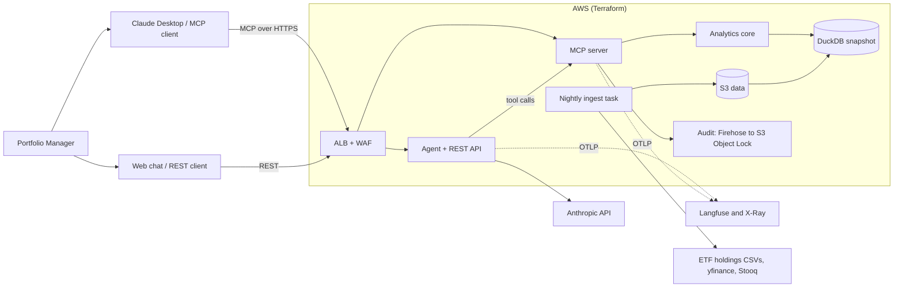
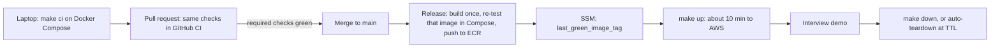

# Portfolio Intelligence MCP Server + PM Agent — Build Blueprint

A top-to-bottom guide for building, testing, observing and deploying an MCP server that answers portfolio manager questions with deterministic analytics, orchestrated by an LLM agent.

**Defaults used in this blueprint** (swap any of them; the architecture does not change): Python 3.12, `uv` for packaging, Docker Compose as the development environment, AWS `ca-central-1` with ECS Fargate as a disposable demo target, OpenTelemetry for all telemetry with Langfuse as the LLM-trace backend, GitHub Actions for CI/CD with green-only image promotion, Terraform ≥ 1.10.

The architecture diagram ships alongside this document as `portfolio-intel-architecture.svg` / `.png`. A text version is below.



---

## How to read this blueprint

Each section uses the same labels so you can tell what to do from what to know:

- **Steps** — numbered actions. Do them in order. File paths are relative to the repository root.
- **> Note —** background and reasoning. Nothing to do; read once.
- **> Watch out —** a gotcha that will cost you time if ignored.
- **✅ Done when** — the checklist that tells you a section or phase is finished.

Phases 0 and 1 are written fully in this format. Later phases use the same code and commands; their explanatory paragraphs are background notes, and their exit criteria are the done-when checks.

---

## Table of contents

0. Design principles and scope
1. Phase 0 — Environment and codebase setup
2. Phase 1 — Data layer: holdings, prices, FX, classification
3. Phase 2 — Analytics core (the maths)
4. Phase 3 — MCP server
5. Phase 4 — Guardrails and audit log
6. Phase 5 — Agent and REST API
7. Phase 6 — Observability (OpenTelemetry + Langfuse)
8. Phase 7 — Testing and agent evaluation
9. Phase 8 — Harden the container and finalise the local stack
10. Phase 9 — Infrastructure as code: persistent foundation, disposable runtime
11. Phase 10 — CI/CD: green-only promotion and one-click environments
12. Phase 11 — Demo script, interview prep, stretch goals
13. Appendix — Azure equivalents, cost notes, checklist

Rough effort for one developer part-time: Phases 0–2 one week, Phases 3–5 one week, Phases 6–8 four to five days, Phases 9–10 four to five days, polish and demo two days.

---

## 0. Design principles and scope

These principles are what separate this project from "a chatbot on a spreadsheet." Write them into the README and refer back to them in interviews.

**The LLM never does maths.** Every number the PM sees must come out of a tool response. Tools return values already in display units (percentage points, basis points, years) with an explicit `unit` field, so the model never converts or sums. A post-generation grounding check (Phase 5) flags any number in the answer that did not appear in a tool output.

**One analytics core, several adapters.** The maths lives in a plain Python package with no knowledge of MCP, HTTP or LLMs. The MCP server and the REST API are thin adapters over a shared service layer. This is the "reusable pattern" story: another team can import the core, call the REST API, or plug any MCP client into the server.

**Read-only by construction, not by prompt.** There is no tool that could submit an order, and the database is opened read-only. The what-if simulator mutates an in-memory copy of weights and labels every result `hypothetical: true`. Guardrails that depend on the model behaving are a bonus, not the control.

**Everything is reproducible.** Each response carries `as_of` date, `data_snapshot_id`, `methodology_version` and a `calc_id` (a hash of inputs plus snapshot). Given the same snapshot, the same question produces identical numbers.

**Honest about coverage.** Securities without enough price history are excluded from the covariance matrix, and every risk result reports what share of active weight was covered. Hiding this is the fastest way to lose a finance interviewer.

**Local-first, ephemeral cloud, green-only deploys.** The laptop is the development environment: the full stack runs in Docker Compose from Phase 0, and `make ci` runs exactly what GitHub CI runs. AWS is a demo target, not a place to debug. Infrastructure is split into a cheap persistent *foundation* (state, images, data, secrets, audit trail, logs) and an expensive *runtime* (network, load balancer, containers). `make up` creates the runtime in about ten minutes; `make down` or an automatic expiry removes it. Only an image that passed CI and was re-tested in Compose is ever marked deployable.

### Delivery workflow at a glance



**In scope:** holdings, active exposures by any classification, ex-ante tracking error and its decomposition, total risk and beta, duration and DV01 for a bond sleeve, a what-if trade simulator, data provenance.
**Out of scope (say so explicitly):** order generation or submission, optimisation, compliance checks, a licensed factor model (a stretch goal covers a home-built one).

### Portfolios used

Two sleeves let you answer both the equity questions and the duration question.

| ID | Role | Source | Why |
|---|---|---|---|
| `EQ_EU_BMK` | Equity benchmark | iShares Core MSCI Europe ETF (IEUR) holdings | Broad European equity universe |
| `EQ_EU_PM` | Equity "PM portfolio" | Synthetic tilt of IEUR (seeded script) | Produces meaningful active weights and ~2–4% TE |
| `EQ_EU_VGK` | Alternative real portfolio | Vanguard FTSE Developed Europe (VGK) holdings | Real second provider; allows realised TE from ETF prices |
| `FI_US_BMK` | Bond benchmark | iShares Core US Aggregate Bond ETF (AGG) holdings | Holdings file includes per-bond duration |
| `FI_US_PM` | Bond "PM portfolio" | Synthetic tilt of AGG | Active duration and sector bets |

Why synthetic tilts: two broad ETFs tracking similar indices give a tracking error well under 1%, which makes the decomposition boring and the what-if deltas tiny. The synthetic portfolio is generated deterministically from a seed and a documented tilt file, so it is still fully reproducible. Keep VGK vs IEUR as a "real data" demo.

Check the providers' terms of use; for a portfolio demo, commit a dated snapshot of the CSVs as test fixtures rather than scraping continuously.

---

## 1. Phase 0 — Environment and codebase setup

**Goal:** an empty but fully wired project. Tools installed, repository created, secrets handled safely, the local Docker stack running, and one passing test.

### 1.1 Install the tools

**Steps**

1. Install Python 3.12 and [`uv`](https://docs.astral.sh/uv/): `curl -LsSf https://astral.sh/uv/install.sh | sh`
2. Install Docker Desktop (or Docker Engine with Compose v2).
3. Install Terraform (version 1.10 or newer) and the AWS CLI v2.
4. Install Node.js 20+.
5. Install Claude Desktop.
6. Create accounts: AWS, Anthropic API (console.anthropic.com), Langfuse Cloud (free Hobby plan), GitHub.

> **Note —** Node.js is only needed for two helper tools (the MCP Inspector and `mcp-remote`). Terraform 1.10 is the first version with S3-native state locking, which Phase 9 uses. You won't need the AWS account until Phase 9.

### 1.2 Create the repository

**Steps**

1. Create the project and initialise Git and uv:
   ```bash
   mkdir portfolio-intel && cd portfolio-intel
   git init
   uv init --package --name portfolio-intel --python 3.12
   ```
2. Add the runtime dependencies:
   ```bash
   uv add "mcp[cli]>=1.10" pandas numpy scikit-learn duckdb pyarrow yfinance httpx \
          pydantic pydantic-settings fastapi "uvicorn[standard]" anthropic structlog \
          opentelemetry-sdk opentelemetry-exporter-otlp \
          opentelemetry-instrumentation-fastapi opentelemetry-instrumentation-httpx \
          opentelemetry-instrumentation-asgi langfuse boto3 pyyaml
   ```
3. Add the development-only dependencies:
   ```bash
   uv add --dev pytest pytest-cov pytest-asyncio hypothesis ruff mypy pandas-stubs pre-commit
   ```

> **Note —** `uv init --package` creates `pyproject.toml` and a `src/portfolio_intel/` package. `uv add` records each dependency in `pyproject.toml` and pins exact versions in `uv.lock`; commit both files.

### 1.3 Repository layout (reference)

This is the layout you will have by the end of the project. **Don't create it all now.** Each phase tells you which files to create.

```
portfolio-intel/
├── Makefile                      # single interface for humans and CI
├── pyproject.toml / uv.lock
├── .pre-commit-config.yaml
├── .gitignore
├── .env.example / .env.ci        # .env itself is gitignored
├── src/portfolio_intel/
│   ├── config.py                 # all settings, read from environment / .env
│   ├── data/
│   │   ├── download.py           # fetch iShares holdings CSVs
│   │   ├── ishares.py            # parse iShares CSVs
│   │   ├── vanguard.py           # parse Vanguard CSVs
│   │   ├── symbols.py            # ticker + exchange → price symbol
│   │   ├── prices.py             # yfinance / Stooq loaders + FX
│   │   ├── classify.py           # industry enrichment + overrides
│   │   ├── synth.py              # seeded synthetic PM portfolios
│   │   ├── validate.py           # data quality checks
│   │   ├── store.py              # DuckDB schema + read-only access
│   │   └── cli.py                # `pi-ingest` entrypoint
│   ├── analytics/                # models, returns, covariance, exposures, risk, fixed_income, whatif
│   ├── service.py                # shared façade used by MCP + REST
│   ├── mcp_server/               # server, guardrails, audit, auth
│   ├── agent/                    # prompts, loop, grounding
│   ├── api/app.py                # FastAPI: /v1/ask + /v1/analytics/*
│   └── telemetry.py
├── reference/                    # committed mapping and config files
│   ├── sources.yaml
│   ├── exchange_suffix.csv
│   ├── symbol_overrides.csv
│   ├── industry_map.csv
│   └── tilts_eq_eu.yaml
├── data/                         # gitignored, except data/fixtures/
├── audit/                        # gitignored; local audit log
├── tests/{unit,property,integration,evals}/
├── docker/{Dockerfile,compose.yaml,otel-collector.yaml,otel-collector.local.yaml}
├── scripts/{env_up.sh,env_down.sh,env_status.sh,env_expire_check.sh,smoke.py}
├── infra/terraform/{bootstrap,foundation,runtime,modules}/
├── .github/workflows/{ci.yml,release.yml,env-up.yml,env-down.yml,auto-teardown.yml,evals.yml}
└── docs/{methodology.md,limitations.md,architecture.svg}
```

### 1.4 Tooling configuration

**Steps**

1. Open `pyproject.toml` (repo root) and append:
   ```toml
   [project.scripts]
   pi-ingest = "portfolio_intel.data.cli:main"
   pi-mcp    = "portfolio_intel.mcp_server.server:main"
   pi-api    = "portfolio_intel.api.app:main"

   [tool.ruff]
   line-length = 100
   target-version = "py312"
   [tool.ruff.lint]
   select = ["E", "F", "I", "B", "UP", "N", "SIM", "RUF", "PD", "NPY"]

   [tool.mypy]
   strict = true
   plugins = ["pydantic.mypy"]

   [tool.pytest.ini_options]
   testpaths = ["tests"]
   asyncio_mode = "auto"
   markers = ["integration", "eval"]
   ```
2. Create a new file named `.pre-commit-config.yaml` **in the repository root** (next to `pyproject.toml`) with:
   ```yaml
   repos:
     - repo: https://github.com/astral-sh/ruff-pre-commit
       rev: v0.6.9
       hooks: [{id: ruff, args: [--fix]}, {id: ruff-format}]
     - repo: https://github.com/pre-commit/pre-commit-hooks
       rev: v4.6.0
       hooks: [{id: detect-private-key}, {id: check-added-large-files}]
   ```
3. Install the Git hook: `uv run pre-commit install`
4. Optional: check all files once with `uv run pre-commit run --all-files`

> **Note —** Pre-commit only looks for its config in the repository root. The file name starts with a dot, so it is hidden: use `ls -a` to see it, or Cmd+Shift+. in the macOS Finder. The `[project.scripts]` entries point at modules you'll write later; that's fine, they are only used once those modules exist.

### 1.5 Configuration and secrets

**Steps**

1. Create `src/portfolio_intel/config.py`:
   ```python
   from pydantic_settings import BaseSettings, SettingsConfigDict


   class Settings(BaseSettings):
       model_config = SettingsConfigDict(env_file=".env", env_prefix="PI_", extra="ignore")

       env: str = "local"
       base_currency: str = "USD"
       duckdb_path: str = "data/portfolio.duckdb"
       data_bucket: str | None = None  # S3 bucket in AWS
       snapshot_key: str | None = None

       risk_window_days: int = 504  # ~2 years of daily returns
       min_price_coverage: float = 0.90
       methodology_version: str = "1.0.0"

       mcp_url: str = "http://localhost:8001/mcp"
       mcp_token: str = "dev-token-change-me"
       anthropic_model: str = "claude-sonnet-5"
       agent_max_steps: int = 8

       audit_sink: str = "jsonl"  # jsonl | firehose
       audit_path: str = "audit/audit.jsonl"
       audit_stream: str | None = None


   settings = Settings()
   ```
2. Create `.env.example` in the repo root. This is a template: names and comments, no real values.
   ```bash
   # Copy to .env and fill in. Never commit .env.
   ANTHROPIC_API_KEY=            # console.anthropic.com
   LANGFUSE_PUBLIC_KEY=          # Langfuse project settings
   LANGFUSE_SECRET_KEY=
   LANGFUSE_BASIC_AUTH=          # base64 of "public_key:secret_key"
   PI_MCP_TOKEN=                 # any long random string: openssl rand -hex 32
   PI_DUCKDB_PATH=data/portfolio.duckdb
   PI_DATA_FILE=/data/portfolio.duckdb   # path inside the containers
   OTEL_CONFIG=otel-collector.local.yaml # set to otel-collector.yaml to also send traces to Langfuse
   ```
3. Create your real `.env`: run `cp .env.example .env`, then fill in your keys.
4. Create `.env.ci` in the repo root. It holds fake values only, so CI can start the stack without real keys.
   ```bash
   PI_MCP_TOKEN=ci-token
   PI_DATA_FILE=/data/fixtures/portfolio_small.duckdb
   OTEL_CONFIG=otel-collector.local.yaml
   ANTHROPIC_API_KEY=
   LANGFUSE_PUBLIC_KEY=
   LANGFUSE_SECRET_KEY=
   LANGFUSE_BASIC_AUTH=
   ```
5. Create `.gitignore` in the repo root:
   ```
   .env
   .venv/
   __pycache__/
   data/*
   !data/fixtures/
   audit/
   .terraform/
   *.tfstate*
   ```
6. Run `git status` and confirm that `.env` is **not** listed.

> **Note — why three env files:**
>
> | File | Contains | Committed? |
> |---|---|---|
> | `.env.example` | Variable names and comments | Yes (it's documentation) |
> | `.env` | Your real keys | **Never** |
> | `.env.ci` | Fake values for CI | Yes (nothing secret) |
>
> `LANGFUSE_*` is shorthand for every variable starting with `LANGFUSE_`. In AWS there is no `.env` file: the same values live in Secrets Manager and are injected into the containers (Phase 9).

> **Watch out —** `extra="ignore"` in `config.py` matters. Without it, pydantic-settings can reject `PI_`-prefixed variables that aren't fields (such as `PI_DATA_FILE`, which only Docker Compose uses). If a key is ever committed by mistake, revoke it in the provider's console immediately; deleting the file from Git is not enough.

### 1.6 Local stack and Makefile

From day one, the project runs in Docker Compose, the same way it will run in AWS. On day one the stack is just a tracing collector and a trace viewer; you add services as you build them.

**Steps**

1. Create `docker/otel-collector.local.yaml`. It receives traces from your code and forwards them to Jaeger, and also prints a summary to the log:
   ```yaml
   receivers:
     otlp:
       protocols:
         grpc: { endpoint: 0.0.0.0:4317 }
         http: { endpoint: 0.0.0.0:4318 }
   processors:
     batch: {}
   exporters:
     otlp/jaeger:
       endpoint: jaeger:4317
       tls: { insecure: true }
     debug:
       verbosity: basic
   service:
     pipelines:
       traces:
         receivers: [otlp]
         processors: [batch]
         exporters: [otlp/jaeger, debug]
   ```
2. Create the day-one `docker/compose.yaml`:
   ```yaml
   services:
     otel:
       image: otel/opentelemetry-collector-contrib:0.110.0
       command: ["--config=/etc/otel.yaml"]
       volumes: ["./${OTEL_CONFIG:-otel-collector.local.yaml}:/etc/otel.yaml:ro"]
       environment: { LANGFUSE_BASIC_AUTH: "${LANGFUSE_BASIC_AUTH:-}" }
       ports: ["4318:4318"]          # lets code run with `uv run` on your machine send traces too
       depends_on: [jaeger]
     jaeger:
       image: jaegertracing/all-in-one:1.62.0
       ports: ["16686:16686"]        # Jaeger web UI
   ```
3. Create a file named exactly `Makefile` (no extension) in the repo root:

```make
-include .env
export

COMPOSE := docker compose --env-file .env -f docker/compose.yaml
ENV     ?= dev
AS_OF   ?= $(shell date +%F)

.PHONY: help setup lint test local-up local-down local-logs ci ingest fixture eval up down status

help: ## list targets
	@grep -E '^[a-z-]+:.*##' $(MAKEFILE_LIST) | awk -F':.*## ' '{printf "  %-12s %s\n", $$1, $$2}'

setup: ## install dependencies and git hooks
	uv sync && uv run pre-commit install

lint: ## ruff + mypy
	uv run ruff check . && uv run ruff format --check . && uv run mypy src

test: ## fast unit and property tests
	uv run pytest -m "not eval and not integration" --cov=portfolio_intel --cov-fail-under=85

local-up: ## build the image and start the stack; waits for health checks
	$(COMPOSE) up -d --build --wait

local-down: ## stop the local stack
	$(COMPOSE) down

local-logs: ## tail container logs
	$(COMPOSE) logs -f --tail=100

ci: lint test local-up ## exactly what GitHub CI runs; do this before every push
	uv run pytest -m integration
	uv run python scripts/smoke.py http://localhost:8000 http://localhost:8001/mcp
	docker run --rm -v /var/run/docker.sock:/var/run/docker.sock aquasec/trivy:latest \
	  image --severity CRITICAL,HIGH --exit-code 1 --ignore-unfixed pi:local

ingest: ## build a real data snapshot (needs internet)
	uv run pi-ingest --as-of $(AS_OF) --out data/portfolio.duckdb

fixture: ## rebuild the small committed test snapshot
	uv run pi-ingest --as-of $(AS_OF) --fixture --out data/fixtures/portfolio_small.duckdb

eval: local-up ## golden PM questions against the local stack (calls the Anthropic API)
	uv run pytest -m eval

up: ## create the AWS runtime from the last green image (about 10 min)
	scripts/env_up.sh $(ENV)

down: ## destroy the AWS runtime; data, images, audit and logs are kept
	scripts/env_down.sh $(ENV)

status: ## is the AWS runtime up, which image, when does it expire
	scripts/env_status.sh $(ENV)
```

4. Run `make help` to check the Makefile is valid.
5. Run `make local-up`, then open **http://localhost:16686**. You should see the Jaeger UI (with no traces yet).
6. Run `make local-down` to stop the stack.

> **Watch out —** every indented recipe line in a Makefile must start with a **tab**, not spaces. Otherwise `make` fails with "missing separator".

> **Note — what the pieces are:** the **OpenTelemetry Collector** receives timing records ("traces") of every request and tool call and forwards them. **Jaeger** is a free local web UI for viewing traces. Later you'll also forward to Langfuse. `-include .env` plus `export` makes your `.env` values available to every Make recipe, and does nothing if the file is missing.

> **Note — how `compose.yaml` grows:**
>
> | When | Add |
> |---|---|
> | Phase 0 (now) | `otel`, `jaeger` |
> | Phase 3 | `mcp` service |
> | Phase 5 | `api` service |
> | Phase 8 | Harden everything: read-only filesystem, health checks, non-root user (final file in 9.2) |

> **Note — which Make targets work when:**
>
> | Target | Works from |
> |---|---|
> | `help`, `setup`, `lint`, `local-up`, `local-down`, `local-logs` | Now |
> | `test` | After 1.7 below |
> | `ingest`, `fixture` | Phase 1 |
> | `ci`, `eval` | Phase 3 / Phase 5 (they need the MCP server and the smoke test) |
> | `up`, `down`, `status` | Phase 9 (AWS) |

> **Note — working rule for the rest of the build:** from Phase 3 onwards, every exit criterion is checked with `make ci` on the Compose stack, not only with `uv run`. If it doesn't pass locally, don't push it.

### 1.7 First test

**Steps**

1. Create the test folders: `mkdir -p tests/unit`
2. Create `tests/unit/test_config.py`:
   ```python
   from portfolio_intel.config import Settings


   def test_settings_load_defaults():
       s = Settings()
       assert s.base_currency == "USD"
       assert s.risk_window_days > 0
   ```
3. Run `make test`. You should see `1 passed`.

> **Note —** this placeholder exists because `make test` fails with zero tests: pytest exits with an error when it finds nothing, and the 85% coverage threshold fails too. Pytest only collects files and functions whose names start with `test_`. From Phase 2, this folder fills with the real maths tests (section 8.2).

> **Watch out —** `Settings()` reads your `.env`. A line such as `PI_BASE_CURRENCY=EUR` there would make the first assertion fail.

### Phase 0 — done when

- [ ] `make lint test` passes
- [ ] `git status` does not list `.env`
- [ ] Pre-commit hooks are installed (`.git/hooks/pre-commit` exists)
- [ ] `make local-up` starts the collector and Jaeger, and the Jaeger UI loads at `localhost:16686`

---

## 2. Phase 1 — Data layer

**Goal:** a single DuckDB file containing a security master, holdings for all five portfolios, daily prices, FX and classifications, plus a data-quality report. The ingest job is the only component that writes data or touches the internet.

### 2.1 Download the holdings files

You need three funds:

| Ticker | Provider | Role | How you get it |
|---|---|---|---|
| IEUR | iShares | Equity benchmark | Script (automated) |
| AGG | iShares | Bond benchmark | Script (automated) |
| VGK | Vanguard | "Real" second equity portfolio | Manual download |

The two synthetic PM portfolios are generated from IEUR and AGG in section 2.6, so they need no download.

**Steps — find each iShares fund's ID (once per fund)**

1. Go to ishares.com (US site) and open the **IEUR** fund page.
2. In the **Holdings** section, right-click **"Detailed Holdings and Analytics"** and choose **Copy link address**.
3. Paste the link somewhere and find the number after `portfolioId=`. For IEUR it is `264617`.
4. Repeat for **AGG**.

**Steps — record the IDs**

5. Create `reference/sources.yaml`:
   ```yaml
   ishares:
     IEUR:
       portfolio_id: 264617
       role: equity benchmark
     AGG:
       portfolio_id: 000000        # replace with AGG's portfolioId from step 4
       role: bond benchmark

   vanguard:
     VGK:
       role: real equity portfolio
       method: manual
   ```

**Steps — download with a script**

6. Create `src/portfolio_intel/data/download.py`:
   ```python
   """Download iShares holdings CSVs into data/raw/ishares/<TICKER>/<as_of>.csv."""

   import re
   import sys
   from datetime import date, datetime, timedelta
   from pathlib import Path

   import httpx
   import yaml

   URL = (
       "https://www.blackrock.com/varnish-api/blk-one01-product-data/product-data/api/v1/"
       "get-fund-document?appType=PRODUCT_PAGE&appSubType=ISHARES&targetSite=us-ishares"
       "&locale=en_US&userType=individual&component=holdings"
       "&portfolioId={pid}&asOfDate={yyyymmdd}"
   )
   AS_OF_RE = re.compile(r'Fund Holdings as of,"?([^"\n]+)"?')
   HEADERS = {"User-Agent": "Mozilla/5.0 (portfolio-intel research project)"}
   RAW = Path("data/raw/ishares")


   def previous_weekday(d: date) -> date:
       d -= timedelta(days=1)
       while d.weekday() >= 5:  # 5 = Saturday, 6 = Sunday
           d -= timedelta(days=1)
       return d


   def fetch(pid: int, day: date) -> tuple[bytes, str] | None:
       """Return (raw bytes, as-of date inside the file), or None if no file for that day."""
       r = httpx.get(
           URL.format(pid=pid, yyyymmdd=day.strftime("%Y%m%d")),
           headers=HEADERS,
           timeout=60,
           follow_redirects=True,
       )
       if r.status_code != 200:
           return None
       m = AS_OF_RE.search(r.content.decode("utf-8-sig", errors="replace"))
       if not m:
           return None  # an error page or empty response, not a CSV
       as_of = datetime.strptime(m.group(1).strip(), "%b %d, %Y").date().isoformat()
       return r.content, as_of


   def download_ishares(ticker: str, pid: int, day: date, max_lookback: int = 5) -> Path:
       for _ in range(max_lookback):  # step back over holidays
           got = fetch(pid, day)
           if got:
               break
           print(f"{ticker}: nothing for {day}, trying the previous weekday")
           day = previous_weekday(day)
       else:
           raise RuntimeError(f"{ticker}: no holdings file in the last {max_lookback} weekdays")

       content, as_of = got
       out = RAW / ticker / f"{as_of}.csv"  # named by the date written inside the file
       if out.exists():
           print(f"{ticker}: {out} already exists, not overwriting")
           return out
       out.parent.mkdir(parents=True, exist_ok=True)
       out.write_bytes(content)
       out.chmod(0o444)  # raw files are read-only
       print(f"{ticker}: saved {out}")
       return out


   def main() -> None:
       cfg = yaml.safe_load(Path("reference/sources.yaml").read_text())
       day = date.fromisoformat(sys.argv[1]) if len(sys.argv) > 1 else previous_weekday(date.today())
       for ticker, fund in cfg["ishares"].items():
           download_ishares(ticker, int(fund["portfolio_id"]), day)


   if __name__ == "__main__":
       main()
   ```
7. Run it from the repo root:
   ```bash
   uv run python -m portfolio_intel.data.download               # most recent weekday
   uv run python -m portfolio_intel.data.download 2026-09-25    # a specific date
   ```
8. Open one saved file and check its shape: about nine lines of fund information (starting with the fund name and `Fund Holdings as of,"…"`), a blank line, then a header row starting `Ticker,Name,Sector,…`, then the holdings.

**Steps — Vanguard (VGK), by hand**

9. On the VGK fund page at investor.vanguard.com, open the portfolio/holdings section and download the full holdings list **as CSV** (the export is called "Holdings details").
10. Find the as-of date inside the file: line 6 reads `Equity,as of MM/DD/YYYY`.
11. Save the file **exactly as downloaded** as `data/raw/vanguard/VGK/<as_of>.csv`, with the date in YYYY-MM-DD form (for example `data/raw/vanguard/VGK/2026-08-31.csv`).
12. Copy the same file to `data/fixtures/raw/vanguard/VGK/<as_of>.csv` and commit that copy.

> **Note — anatomy of the iShares URL:** only two parts change. `portfolioId` identifies the fund and `asOfDate` (YYYYMMDD) is the day. Everything else is fixed, which is why `sources.yaml` stores one ID per fund rather than full URLs. Older tutorials show a different format (`ishares.com/us/products/<id>/<slug>/1467271812596.ajax?fileType=csv…`); the file it returns has the same layout, so the parser works with either.

> **Note — why the script names files by the date inside them:** if you run it on a Sunday, or ask for a holiday, iShares returns an earlier business day's file. The script steps back over missing days, and the file name always matches the data it contains.

> **Note — why never modify raw files:** they are your evidence of exactly what the provider published. All cleaning happens in the parser code (section 2.2), so a parsing bug is fixed by changing code and re-running, and any number can be traced back to an untouched source file. The script makes files read-only (`chmod 444`) to prevent accidental edits.

> **Note — why VGK is manual and committed:** Vanguard's holdings table is built with JavaScript and has no stable download URL, so scraping it would be fragile. The project is about analytics, not scraping. Committing the copy under `data/fixtures/` keeps the project reproducible, because nobody can re-download that exact file automatically. Vanguard's public holdings may be updated less often than iShares' daily files; that's fine, but record the date.

> **Watch out — don't open and re-save the CSV in Excel.** Excel displays numeric-looking SEDOLs without their leading zeros (HSBC's `0540528` shows as `540528`), and saving from Excel writes them that way, corrupting the identifier. To look at the file, use a text editor or open it read-only. The parser reads every column as text, so the original file is always safe.

> **Note — S3 comes later:** in Phase 9 the same folder layout is mirrored to the S3 data bucket (`aws s3 sync data/raw s3://<bucket>/raw/`). For now, everything stays on your laptop.

> **Watch out —** if the script reports "no holdings file", open one of its URLs in your browser. If it downloads there, BlackRock may be rejecting the script's request (try a different `User-Agent`). If it doesn't download, re-copy the link from the fund page in case the `portfolioId` or URL format has changed. Check the provider's terms of use, and don't hammer the endpoint: one request per fund per day is plenty.

**✅ Done when**

- [ ] `reference/sources.yaml` has both iShares portfolio IDs
- [ ] The script saves `data/raw/ishares/IEUR/<date>.csv` and `data/raw/ishares/AGG/<date>.csv`
- [ ] The VGK CSV exists, unmodified, in both `data/raw/vanguard/VGK/` and `data/fixtures/raw/vanguard/VGK/`

### 2.2 Parse the iShares CSVs

**Steps**

1. Create `src/portfolio_intel/data/ishares.py`:
   ```python
   import io
   import re
   from datetime import datetime
   from pathlib import Path

   import pandas as pd

   AS_OF_RE = re.compile(r'Fund Holdings as of,"?([^"\n]+)"?')

   COLUMNS = {
       "Ticker": "ticker",
       "Name": "name",
       "Sector": "sector",
       "Asset Class": "asset_class",
       "Market Value": "market_value",
       "Weight (%)": "weight_pct",
       "Location": "country",
       "Exchange": "exchange",
       "Currency": "fund_currency",  # the ETF's reporting currency (USD on every row)
       "Market Currency": "currency",  # the security's own trading currency
       # fixed-income files only:
       "ISIN": "isin",
       "CUSIP": "cusip",
       "Duration": "duration",
       "Maturity": "maturity",
       "Coupon (%)": "coupon_pct",
       "YTM (%)": "ytm_pct",
   }


   def read_ishares(path: Path) -> tuple[pd.DataFrame, str]:
       text = path.read_text(encoding="utf-8-sig")
       lines = text.splitlines()
       m = AS_OF_RE.search(text)
       if not m:
           raise ValueError(f"{path}: no 'Fund Holdings as of' line")
       as_of = datetime.strptime(m.group(1).strip(), "%b %d, %Y").date().isoformat()

       start = next(i for i, l in enumerate(lines) if l.lstrip('"').startswith(("Ticker,", "Name,")))
       body = []
       for line in lines[start:]:
           if not line.strip() or line.startswith(("\xa0", '"\xa0', "The content")):
               break  # end of holdings; disclaimer footer follows
           body.append(line)
       df = pd.read_csv(
           io.StringIO("\n".join(body)),
           thousands=",",
           na_values=["-", ""],
           keep_default_na=False,
           dtype={"Ticker": str},
       )
       df = df.rename(columns={k: v for k, v in COLUMNS.items() if k in df.columns})
       df["weight"] = df.pop("weight_pct") / 100.0
       return df, as_of
   ```
2. Load each downloaded file in a Python shell or notebook and print `df.columns`, `df.head()` and `df["asset_class"].value_counts()`.
3. Add the handling for non-security rows (in `ishares.py` or `validate.py`) using this table:

   | `asset_class` value | Examples | Treatment |
   |---|---|---|
   | `Equity`, `Fixed Income` | ASML, HSBC, a Treasury bond | Keep as a security |
   | `Cash`, `Money Market` | `EUR CASH`, `CHF CASH`, `XTSLA` | Sum into one `CASH` line (zero volatility, zero duration) |
   | `Cash Collateral and Margins` | `CASH COLLATERAL EUR` | Exclude, and report its weight in the DQ report |
   | `FX`, `Futures` | Currency forwards, index futures | Exclude, and report its weight in the DQ report |

4. For the AGG file, compare its column names against the `COLUMNS` map and add any that differ. Record in `docs/methodology.md` whether the duration column is effective or modified duration.

> **Watch out — `Currency` vs `Market Currency`:** in these files `Currency` is `USD` on every row because it's the fund's reporting currency. The security's real trading currency (EUR, GBP, CHF, SEK…) is in `Market Currency`. The parser therefore maps `Market Currency` → `currency`, and every later step (FX in 2.4, returns in 3.2) uses that column.

> **Watch out — weights are percentages:** `Weight (%)` of `4.36` means 4.36%, so the parser divides by 100.

> **Note —** equity files start their header row with `Ticker`; fixed-income files may start with `Name` or `Ticker`, which is why the parser checks for both. iShares occasionally renames columns, so if a column is missing, print `df.columns` and update the map rather than hard-coding positions. `dtype={"Ticker": str}` stops pandas turning tickers like `0001` into numbers.

**✅ Done when**

- [ ] IEUR parses to roughly 1,000 rows, with weights summing to about 1.0 (before removing collateral)
- [ ] `df["currency"].unique()` shows local currencies (EUR, GBP, CHF, SEK, DKK, NOK, USD…), not just USD

### 2.2b Parse the Vanguard CSV (VGK)

The Vanguard export is laid out differently from the iShares file, has no exchange column, and contains some French-market oddities. This section parses it and gives every holding the same kind of `security_id` as IEUR, so the two can be compared.

**Steps — parse the file**

1. Create `src/portfolio_intel/data/vanguard.py`:

```python
"""Parse Vanguard 'Holdings details' CSV exports (e.g. VGK)."""

import io
import re
from datetime import datetime
from pathlib import Path

import pandas as pd

from .symbols import normalise_ticker

SECTION_RE = re.compile(r"^(Equity|Fixed income|Short-term reserves),as of (\d{2}/\d{2}/\d{4})")
ISO2_TO_COUNTRY = {
    "AT": "Austria",
    "BE": "Belgium",
    "CH": "Switzerland",
    "DE": "Germany",
    "DK": "Denmark",
    "ES": "Spain",
    "FI": "Finland",
    "FR": "France",
    "GB": "United Kingdom",
    "IE": "Ireland",
    "IT": "Italy",
    "NL": "Netherlands",
    "NO": "Norway",
    "PL": "Poland",
    "PT": "Portugal",
    "SE": "Sweden",
    "US": "United States",
}
# Loyalty-share ("prime de fidélité") and untickered French lines -> parent company name
PF_RE = re.compile(r"\s*-\s*PF\b.*$|\s*\(PRIM FIDELITE\).*$|\s+EUR4\b", re.I)
NON_TRADEABLE_RE = re.compile(r"-RTS\b|-WRT\b|- CVR\b", re.I)


def _money(s: pd.Series) -> pd.Series:
    return pd.to_numeric(s.str.replace(r"[$,]", "", regex=True), errors="coerce")


def _sections(lines: list[str]) -> dict[str, tuple[str, pd.DataFrame]]:
    out = {}
    for i, line in enumerate(lines):
        m = SECTION_RE.match(line)
        if not m:
            continue
        h = next(k for k in range(i + 1, len(lines)) if lines[k].startswith(",SEDOL"))
        rows = [lines[h]]
        for row in lines[h + 1 :]:
            if not row.strip():
                break
            rows.append(row)
        df = pd.read_csv(io.StringIO("\n".join(rows)), dtype=str, keep_default_na=False)
        df = df.drop(columns=[c for c in df.columns if c.startswith("Unnamed")])
        as_of = datetime.strptime(m.group(2), "%m/%d/%Y").date().isoformat()
        out[m.group(1)] = (as_of, df)
    return out


def read_vanguard(path: Path) -> tuple[pd.DataFrame, str]:
    text = path.read_text(encoding="utf-8-sig")
    lines = text.replace("\r\n", "\n").replace("\r", "\n").split("\n")
    secs = _sections(lines)
    as_of, eq = secs["Equity"]

    df = pd.DataFrame(
        {
            "sedol": eq["SEDOL"].str.strip(),
            "name": eq["HOLDINGS"].str.strip(),
            "ticker": eq["TICKER"].str.strip().replace("---", ""),
            "sub_industry": eq["SUB-INDUSTRY"].str.strip(),
            "country": eq["COUNTRY"].map(ISO2_TO_COUNTRY).fillna(eq["COUNTRY"]),
            "dr_type": eq["SECURITYDEPOSITORYRECEIPTTYPE"].replace("---", ""),
            "market_value": _money(eq["MARKET VALUE*"]),
            "printed_pct": pd.to_numeric(eq["% OF FUNDS*"].str.rstrip("%"), errors="coerce"),
            "asset_class": "Equity",
        }
    )
    df["is_loyalty_line"] = df["name"].str.contains(PF_RE)
    df["parent_name"] = df["name"].str.replace(PF_RE, "", regex=True).str.strip()
    df["excluded_reason"] = ""
    df.loc[df["name"].str.contains(NON_TRADEABLE_RE), "excluded_reason"] = "right/warrant/CVR"

    # Cash: every line in "Short-term reserves" (currencies, sweep/liquidity funds) -> one CASH row
    cash_mv = 0.0
    if "Short-term reserves" in secs:
        cash_mv = float(_money(secs["Short-term reserves"][1]["MARKET VALUE*"]).sum())
    if "Fixed income" in secs and len(secs["Fixed income"][1]):
        raise ValueError("VGK unexpectedly holds fixed income; extend the parser")
    cash = pd.DataFrame(
        [
            {
                "sedol": "",
                "name": "CASH",
                "ticker": "",
                "asset_class": "Cash",
                "market_value": cash_mv,
                "excluded_reason": "",
                "is_loyalty_line": False,
                "parent_name": "CASH",
            }
        ]
    )
    df = pd.concat([df, cash], ignore_index=True)

    # Weights from market value, so small '<0.01%' holdings keep real weights and the total is 1
    included = df["excluded_reason"] == ""
    df["weight"] = 0.0
    df.loc[included, "weight"] = (
        df.loc[included, "market_value"] / df.loc[included, "market_value"].sum()
    )
    return df, as_of


# ---------------------------------------------------------------------------
# Security-ID resolution for Vanguard rows (section 2.2b, step 5)
# ---------------------------------------------------------------------------

COUNTRY_DEFAULTS = {  # main exchange suffix and trading currency, used when a name isn't in IEUR
    "United Kingdom": (".L", "GBP"),
    "Germany": (".DE", "EUR"),
    "France": (".PA", "EUR"),
    "Switzerland": (".SW", "CHF"),
    "Netherlands": (".AS", "EUR"),
    "Spain": (".MC", "EUR"),
    "Italy": (".MI", "EUR"),
    "Sweden": (".ST", "SEK"),
    "Denmark": (".CO", "DKK"),
    "Finland": (".HE", "EUR"),
    "Norway": (".OL", "NOK"),
    "Belgium": (".BR", "EUR"),
    "Austria": (".VI", "EUR"),
    "Ireland": (".IR", "EUR"),
    "Portugal": (".LS", "EUR"),
    "Poland": (".WA", "PLN"),
    "United States": ("", "USD"),
}


def resolve_security_ids(
    vgk: pd.DataFrame, ieur: pd.DataFrame, sedol_overrides: dict[str, str]
) -> pd.DataFrame:
    """Give every VGK row a security_id and trading currency.

    vgk:  output of read_vanguard
    ieur: parsed IEUR equities with columns ticker, country, security_id, currency
    sedol_overrides: {"B71JBK1": "OR.PA", ...} from reference/symbol_overrides.csv
    """
    out = vgk.copy()
    out["ticker_norm"] = out["ticker"].map(lambda t: normalise_ticker(t) if t else "")

    # 1. Match to IEUR on normalised ticker + country
    ref = ieur.assign(ticker_norm=ieur["ticker"].map(normalise_ticker))[
        ["ticker_norm", "country", "security_id", "currency"]
    ].drop_duplicates(["ticker_norm", "country"])
    ref = ref[ref["ticker_norm"] != ""]
    out = out.merge(ref, on=["ticker_norm", "country"], how="left")
    out["id_source"] = out["security_id"].notna().map({True: "ieur", False: ""})

    # 2. Manual overrides by SEDOL (win over everything else)
    ov = out["sedol"].map(sedol_overrides)
    out.loc[ov.notna(), "security_id"] = ov[ov.notna()]
    out.loc[ov.notna(), "id_source"] = "override"

    # 3. Country default exchange for tickered equities still unmatched
    miss = (
        out["security_id"].isna()
        & (out["ticker_norm"] != "")
        & (out["asset_class"] == "Equity")
        & (out["excluded_reason"] == "")
    )
    suffix = out.loc[miss, "country"].map(lambda c: COUNTRY_DEFAULTS.get(c, (None, None))[0])
    idx = suffix[suffix.notna()].index
    out.loc[idx, "security_id"] = out.loc[idx, "ticker_norm"] + suffix[idx]
    out.loc[idx, "id_source"] = "country_default"

    # 4. Loyalty-share lines take their parent's security_id (exact name, then name prefix)
    parents = out[
        ~out["is_loyalty_line"] & out["security_id"].notna() & (out["asset_class"] == "Equity")
    ]
    by_name = dict(zip(parents["name"].str.upper(), parents["security_id"]))

    def parent_id(pname: str) -> str | None:
        key = pname.upper()
        if key in by_name:
            return by_name[key]
        hits = {sid for n, sid in by_name.items() if n.startswith(key + " ")}
        return hits.pop() if len(hits) == 1 else None

    loy = out["is_loyalty_line"]
    out.loc[loy, "security_id"] = out.loc[loy, "parent_name"].map(parent_id)
    out.loc[loy & out["security_id"].notna(), "id_source"] = "loyalty_parent"

    # Currency: from IEUR where matched, else the country default
    out["currency"] = out["currency"].fillna(
        out["country"].map(lambda c: COUNTRY_DEFAULTS.get(c, (None, None))[1])
    )

    # Cash line
    cash = out["asset_class"] == "Cash"
    out.loc[cash, ["security_id", "id_source", "currency"]] = ["CASH", "cash", "USD"]
    return out
```

2. In a Python shell, run:
   ```python
   from pathlib import Path
   from portfolio_intel.data.vanguard import read_vanguard

   vgk, as_of = read_vanguard(Path("data/raw/vanguard/VGK/2026-08-31.csv"))
   print(as_of, len(vgk), vgk["weight"].sum())
   print(vgk.loc[vgk["name"] == "CASH", "weight"])
   print(vgk.loc[vgk["excluded_reason"] != "", ["name", "excluded_reason"]])
   ```
3. Compare with the expected results for the 2026-08-31 file:
   ```
   2026-08-31   1229 rows   weight sum 1.0
   CASH weight            ≈ 0.724%
   excluded               NORMA GROUP SE-RTS, WEBUILD SPA-WRT, GREENCORE GROUP PLC - CVR
   loyalty lines          10 rows, ≈ 0.280% of weight
   largest |printed % − computed weight|   ≈ 0.03 percentage points
   ```

**Steps — give each holding a security ID (do these after section 2.3)**

4. Add two rows to `reference/symbol_overrides.csv` for the main L'Oréal and Engie lines, which have no ticker in the file:
   ```
   sedol,ticker,exchange,yahoo_symbol
   B71JBK1,,,OR.PA
   BYZNDP7,,,ENGI.PA
   ```
5. Call the resolver with the parsed and mapped IEUR equities from sections 2.2–2.3:
   ```python
   from portfolio_intel.data.symbols import load_sedol_overrides
   from portfolio_intel.data.vanguard import resolve_security_ids

   vgk = resolve_security_ids(vgk, ieur_equities, load_sedol_overrides())
   print(vgk["id_source"].replace("", "UNRESOLVED").value_counts())
   ```
6. Merge rows that now share a `security_id` (loyalty lines into their parent, and the two L'Oréal lines into one):
   ```python
   vgk_holdings = (
       vgk.dropna(subset=["security_id"])
       .groupby("security_id", as_index=False)
       .agg(
           weight=("weight", "sum"),
           name=("name", "first"),
           currency=("currency", "first"),
           country=("country", "first"),
       )
   )
   ```
7. Include `vgk_holdings` as portfolio `EQ_EU_VGK` in the ingest (section 2.9), with `benchmark_id = EQ_EU_BMK`.

> **Note — how the file is laid out:**
>
> | Part | Contents |
> |---|---|
> | Lines 1–7 | Title, fund name, `Equity,as of 08/31/2026` |
> | Equity section | 1,228 holdings: SEDOL, name, ticker, % of fund, sub-industry, country (ISO code), depositary-receipt type, market value, shares |
> | Fixed income section | Header only (empty for VGK) |
> | Short-term reserves section | 10 lines of currency balances and liquidity funds (≈ 0.72%), including a negative EUR balance |
> | Footer | Disclaimers |
>
> The file starts with a byte-order mark and mixes line endings; the parser handles both.

> **Note — why weights come from market value:** 450 holdings are printed as `<0.01%` rather than a number, and together they are about 2.2% of the fund. Dividing each market value by the total of all listed lines (equities plus reserves) gives weights that sum to exactly 1 and stay within 0.03 percentage points of the printed figures. The printed percentages are relative to the fund's total net assets, which include a small amount of other assets that aren't itemised.

> **Note — how the resolver assigns IDs, in order:**
>
> | Order | Source (`id_source`) | Rule |
> |---|---|---|
> | 1 | `ieur` | Same normalised ticker and country as an IEUR holding: reuse its `security_id` and currency |
> | 2 | `override` | SEDOL listed in `symbol_overrides.csv` |
> | 3 | `country_default` | Ticker plus the country's main exchange suffix (Poland → `.WA`, UK → `.L`, …) |
> | 4 | `loyalty_parent` | Loyalty line takes its parent company's ID (matched on name) |
> | — | `cash` | The single CASH line |
>
> Ticker plus country is what separates duplicate tickers such as `AMS` (ams-OSRAM, Switzerland vs Amadeus, Spain) and `SAN` (Santander vs Sanofi). Where a name matches IEUR, both portfolios get the identical `security_id`, which the active-weight maths needs.

> **Note — French loyalty shares:** lines such as `L'OREAL SA - PF - 2028` are *prime de fidélité* shares: the same stock held in registered form to earn a dividend bonus. They are economically identical to the ordinary share, so they are merged into the parent's `security_id` in step 6.

> **Note — Poland is a genuine difference from the benchmark:** VGK holds 31 Polish stocks (about 1.06%). FTSE classifies Poland as a developed market; MSCI does not, so IEUR holds none. These get `.WA` symbols and PLN as their currency, and they show up as an active position in every VGK-vs-IEUR comparison. It's a good demo talking point about index-provider methodology.

> **Note — sub-industry:** the file includes a sub-industry per holding (for example `Diversified Banks`). Keep it as an attribute and use it to sanity-check your Yahoo-based industry mapping, but classify both portfolios with the same Yahoo taxonomy (section 2.5), otherwise "banks" would mean different things on each side. For reference, Diversified plus Regional Banks are 14.43% of VGK (70 names) in the 2026-08-31 file.

> **Watch out — rows that won't price:** the resolver skips rights, warrants and CVRs. Dead listings still in the file with near-zero value (Evraz, Finablr, whose ticker is `2448132D`) will fail the price download in section 2.4. That's expected: they appear in the data-quality report, and their weight is negligible.

> **Watch out — country defaults can be wrong:** `country` is where a company is domiciled, not always where it mainly trades (for example Borr Drilling is listed as US). If a `country_default` symbol fails to download prices, look it up on Yahoo Finance and add a SEDOL override.

**✅ Done when**

- [ ] `read_vanguard` returns weights summing to 1.0, with CASH ≈ 0.72%
- [ ] After step 5, the only rows without a `security_id` are the three excluded rights/warrants/CVR lines
- [ ] `vgk["currency"]` includes PLN
- [ ] `vgk_holdings` has one row per `security_id`

### 2.3 Map tickers to price symbols

Holdings list local tickers plus an exchange name. Yahoo Finance needs an exchange suffix (`HSBA.L`, `SAN.MC`). This step builds those symbols, and they become each equity's **security ID**.

**Steps**

1. Create `reference/exchange_suffix.csv`, using the exchange names **exactly** as they appear in the iShares file:
   ```
   exchange,yahoo_suffix,stooq_suffix
   London Stock Exchange,.L,.uk
   Xetra,.DE,.de
   Deutsche Boerse Xetra,.DE,.de
   Euronext Amsterdam,.AS,.nl
   Nyse Euronext - Euronext Paris,.PA,.fr
   Nyse Euronext - Euronext Brussels,.BR,.be
   Nyse Euronext - Euronext Lisbon,.LS,.pt
   Borsa Italiana,.MI,.it
   Bolsa De Madrid,.MC,.es
   SIX Swiss Exchange,.SW,.ch
   Nasdaq Omx Nordic,.ST,.se
   Omx Nordic Exchange Copenhagen A/S,.CO,.dk
   Nasdaq Omx Helsinki Ltd.,.HE,.fi
   Oslo Bors Asa,.OL,.no
   Irish Stock Exchange - All Market,.IR,.ie
   Wiener Boerse Ag,.VI,.at
   NYSE,,.us
   NASDAQ,,.us
   ```
2. Create `reference/symbol_overrides.csv` with just the header for now: `sedol,ticker,exchange,yahoo_symbol`. iShares rows fill `ticker` and `exchange`; Vanguard rows fill `sedol` (section 2.2b).
3. Create `src/portfolio_intel/data/symbols.py`:
   ```python
   import re
   from pathlib import Path

   import pandas as pd


   def normalise_ticker(ticker: str) -> str:
       t = ticker.strip().rstrip("./")  # "RR." (iShares) and "RR/" (Vanguard) -> "RR"
       return re.sub(r"[ ./]+", "-", t)  # "BT.A", "BT/A" -> "BT-A"; "NOVO B" -> "NOVO-B"


   def load_suffixes(path: Path = Path("reference/exchange_suffix.csv")) -> dict[str, str]:
       df = pd.read_csv(path, keep_default_na=False)  # keep empty suffixes as ""
       return dict(zip(df["exchange"], df["yahoo_suffix"]))


   def load_overrides(
       path: Path = Path("reference/symbol_overrides.csv"),
   ) -> dict[tuple[str, str], str]:
       """(ticker, exchange) -> symbol, for iShares rows."""
       df = pd.read_csv(path, keep_default_na=False, dtype=str)
       return {(r.ticker, r.exchange): r.yahoo_symbol for r in df.itertuples() if r.ticker}


   def load_sedol_overrides(path: Path = Path("reference/symbol_overrides.csv")) -> dict[str, str]:
       """SEDOL -> symbol, for Vanguard rows."""
       df = pd.read_csv(path, keep_default_na=False, dtype=str)
       return {r.sedol: r.yahoo_symbol for r in df.itertuples() if r.sedol}


   def to_yahoo(
       ticker: str, exchange: str, suffixes: dict[str, str], overrides: dict[tuple[str, str], str]
   ) -> str | None:
       if (ticker, exchange) in overrides:
           return overrides[(ticker, exchange)]
       if exchange not in suffixes:
           return None  # unmapped exchange: reported by the DQ check
       return normalise_ticker(ticker) + suffixes[exchange]
   ```
4. Apply `to_yahoo` to every equity row, and store the result as both `price_symbol` and `security_id`.
5. Print all rows where the result is `None`, and any symbols that fail to download prices in 2.4. Add a line to `symbol_overrides.csv` for each, looking up the correct symbol on Yahoo Finance.
6. Add a unit test for `normalise_ticker` covering the cases in the table below.

> **Note — ticker formats in the file:**
>
> | In the file | Rule | Yahoo symbol |
> |---|---|---|
> | `RR.`, `BP.`, `BA.` | Drop the trailing dot | `RR.L`, `BP.L`, `BA.L` |
> | `BT.A` | Dot becomes hyphen | `BT-A.L` |
> | `NOVO B`, `VOLV B`, `NDA FI` | Space becomes hyphen | `NOVO-B.CO`, `VOLV-B.ST`, `NDA-FI.HE` |
> | `SPOT` on `NYSE` | No suffix | `SPOT` |
> | `RR/`, `BT/A`, `GRF/P` (Vanguard style) | Drop trailing slash; inner slash becomes hyphen | `RR.L`, `BT-A.L`, `GRF-P.MC` |

> **Watch out — tickers are not unique on their own.** The IEUR file has two `SAN` rows (Banco Santander on Bolsa De Madrid, Sanofi on Euronext Paris), and also duplicates for `UNI`, `AMS` and `LAND`. Always identify an equity by ticker **plus** exchange. The Yahoo symbol does this (`SAN.MC` vs `SAN.PA`), so it is used as the security ID. Never join tables on the raw ticker.

> **Note —** the `Location` column is the company's country (for example, `Sweden` for Spotify even though it trades on NYSE). Use it for country and region exposures; use `Exchange` only for symbol mapping. Expect to hand-map 2–5% of names in `symbol_overrides.csv`; that's normal. For bonds, the security ID is the ISIN (falling back to CUSIP), and no price symbol is needed.

**✅ Done when**

- [ ] Every IEUR equity row has a `security_id`, or an entry in the DQ report explaining why not
- [ ] `security_id` is unique within each portfolio

### 2.4 Download prices and FX

**Steps**

1. Add to `src/portfolio_intel/data/prices.py`:
   ```python
   import pandas as pd
   import yfinance as yf


   def download_prices(symbols: list[str], start: str, end: str, batch: int = 100) -> pd.DataFrame:
       frames = []
       for i in range(0, len(symbols), batch):
           chunk = symbols[i : i + batch]
           raw = yf.download(
               chunk,
               start=start,
               end=end,
               auto_adjust=True,
               progress=False,
               group_by="ticker",
               threads=True,
           )
           got = [s for s in chunk if s in raw.columns.get_level_values(0)]
           frames.append(pd.concat({s: raw[s]["Close"] for s in got}, axis=1))
       return pd.concat(frames, axis=1).sort_index()  # index=date, columns=symbol


   def download_fx(currencies: set[str], base: str, start: str, end: str) -> pd.DataFrame:
       """Columns = currency, values = units of BASE per 1 unit of that currency."""
       pairs = {c: f"{c}{base}=X" for c in currencies if c != base}
       raw = yf.download(list(pairs.values()), start=start, end=end, progress=False)["Close"]
       fx = pd.DataFrame({c: raw[p] for c, p in pairs.items()})
       fx[base] = 1.0
       return fx.sort_index()
   ```
2. Call `download_prices` for all equity `security_id`s, with a start date at least `risk_window_days + 30` calendar days ago.
3. Call `download_fx` with the set of trading currencies from **both** portfolios (IEUR's `currency` column plus VGK's resolved `currency`, which adds PLN) and `base="USD"`.
4. Cache the results to `data/cache/` (Parquet), and on later runs download only missing symbols and dates.
5. Store prices in long form: `date, security_id, close, currency, source`.

> **Note —** `auto_adjust=True` gives dividend- and split-adjusted prices, so returns approximate total returns. London prices are quoted in pence (`GBp`); returns don't care about scale, and weights and market values come from the holdings file, not from prices. Stooq is the fallback source (`https://stooq.com/q/d/l/?s=<symbol><stooq_suffix>&i=d` returns a CSV); it rate-limits, so cache every file.

### 2.5 Industry classification

The question "active weight in European banks" needs industry, not sector. iShares only gives GICS sector, and GICS industry data is licensed.

**Steps**

1. For each equity, fetch `yf.Ticker(symbol).info["industry"]` (for example "Banks - Diversified", "Banks - Regional") and cache the results in `data/cache/industry.json`.
2. Create `reference/industry_map.csv` mapping Yahoo industries to a simple taxonomy:
   ```
   yahoo_industry,industry,industry_group
   Banks - Diversified,Banks,Banks
   Banks - Regional,Banks,Banks
   Insurance - Diversified,Insurance,Insurance
   Asset Management,Capital Markets,Diversified Financials
   ```
3. Allow manual overrides for names where Yahoo returns nothing or something wrong.
4. Derive `region` from `country` (Europe for the equity sleeve; keep the column so filters work generally).

> **Note —** the `.info` call is slow and rate-limited, hence the cache. Document in `docs/methodology.md` that the taxonomy is Yahoo-derived, not GICS; interviewers respect this if you say it first.

### 2.6 Synthetic PM portfolios

**Steps**

1. Create `reference/tilts_eq_eu.yaml`:
   ```yaml
   seed: 42
   source: EQ_EU_BMK
   cash_weight: 0.02
   industry_tilts:            # multiplicative on benchmark weight
     Banks: 1.35
     Insurance: 1.15
     Pharmaceuticals: 0.80
     Beverages: 0.60
   drop_smallest_pct: 0.30    # hold ~70% of names by count
   idiosyncratic_noise: 0.25  # lognormal sigma on each weight
   ```
2. Create `src/portfolio_intel/data/synth.py`:
   ```python
   import numpy as np
   import pandas as pd


   def make_tilted(bmk: pd.DataFrame, cfg: dict) -> pd.DataFrame:
       rng = np.random.default_rng(cfg["seed"])
       df = bmk[bmk.security_id != "CASH"].copy().sort_values("weight")
       df = df.iloc[int(len(df) * cfg["drop_smallest_pct"]) :]
       mult = df["industry"].map(cfg["industry_tilts"]).fillna(1.0)
       noise = rng.lognormal(0.0, cfg["idiosyncratic_noise"], len(df))
       w = df["weight"] * mult * noise
       df["weight"] = w / w.sum() * (1 - cfg["cash_weight"])
       cash = pd.DataFrame([{"security_id": "CASH", "weight": cfg["cash_weight"]}])
       return pd.concat([df, cash], ignore_index=True)
   ```
3. Create `reference/tilts_fi_us.yaml` for the bond sleeve (for example overweight corporates, underweight Treasuries, overweight bonds with duration above 10) and apply the same approach.

> **Note —** two broad ETFs tracking similar indices give a tracking error under 1%, which makes the risk breakdown dull. A seeded tilt gives meaningful active weights while staying fully reproducible: same seed and tilt file, same portfolio.

### 2.7 DuckDB schema

**Steps**

1. In `src/portfolio_intel/data/store.py`, create these tables:
   ```sql
   CREATE TABLE snapshot   (snapshot_id VARCHAR, created_at TIMESTAMP, as_of DATE,
                            methodology_version VARCHAR, git_sha VARCHAR);
   CREATE TABLE security   (security_id VARCHAR PRIMARY KEY, ticker VARCHAR, exchange VARCHAR,
                            name VARCHAR, asset_class VARCHAR, sector VARCHAR, industry VARCHAR,
                            industry_group VARCHAR, country VARCHAR, region VARCHAR,
                            currency VARCHAR, price_symbol VARCHAR,
                            duration DOUBLE, maturity DATE, coupon_pct DOUBLE);
   CREATE TABLE portfolio  (portfolio_id VARCHAR PRIMARY KEY, name VARCHAR, kind VARCHAR,
                            benchmark_id VARCHAR, base_currency VARCHAR, source VARCHAR);
   CREATE TABLE holding    (as_of DATE, portfolio_id VARCHAR, security_id VARCHAR,
                            weight DOUBLE, market_value DOUBLE);
   CREATE TABLE price      (date DATE, security_id VARCHAR, close DOUBLE,
                            currency VARCHAR, source VARCHAR);
   CREATE TABLE fx         (date DATE, currency VARCHAR, base_per_unit DOUBLE);
   CREATE TABLE dq_issue   (check_name VARCHAR, portfolio_id VARCHAR, security_id VARCHAR,
                            severity VARCHAR, detail VARCHAR);
   ```
2. Add a function `open_readonly(path)` that calls `duckdb.connect(path, read_only=True)`.

> **Note —** `security.currency` is the trading currency (from `Market Currency`). Only the ingest CLI ever opens the database writable; every service uses `open_readonly`.

### 2.8 Data-quality checks

**Steps**

1. In `src/portfolio_intel/data/validate.py`, implement these checks. Errors stop the ingest (non-zero exit); warnings go into the `dq_issue` table.

   | Check | Warn | Error |
   |---|---|---|
   | Portfolio weights sum to 1 after cash aggregation and exclusions | off by > 0.5% | off by > 2% |
   | Duplicate `security_id` within a portfolio and date | | any |
   | Rows with no `security_id` (unmapped symbol) | any | > 3% of weight |
   | Share of benchmark weight with ≥ `min_price_coverage` return history | < 97% | < 90% |
   | Stale prices (> 5 identical closes in a row) | any | |
   | Daily return with absolute value > 40% (likely bad split adjustment) | any | |
   | Weight with no `industry` | > 2% | |
   | Bond sleeve: non-cash bond without duration | | any |
   | Excluded rows (collateral, FX, futures, rights, warrants, CVRs) | report total weight | |
   | VGK rows with no `security_id` after resolution | any | > 1% of weight |
   | VGK weight resolved by `country_default` whose prices fail to download | any | > 1% of weight |

### 2.9 Ingest CLI and fixture snapshot

**Steps**

1. Create `src/portfolio_intel/data/cli.py` so that `pi-ingest --as-of 2026-09-25 --out data/portfolio.duckdb [--upload]` runs, in order: parse raw files (iShares, then Vanguard) → map symbols and resolve VGK IDs (2.2b) → download prices and FX (cached) → classify → build synthetic portfolios → validate → write DuckDB → write a `snapshot` row with a new UUID. With `--upload`, it also uploads to `s3://<bucket>/snapshots/<as_of>/<snapshot_id>/portfolio.duckdb` and updates `snapshots/LATEST` (used from Phase 9).
2. Add a `--fixture` flag that writes `data/fixtures/portfolio_small.duckdb` containing the 50 largest benchmark equities, both PM portfolios restricted to them, the bond sleeve's 50 largest lines, and a frozen price and FX history.
3. Run `make ingest`, then `make fixture`.
4. Commit `data/fixtures/portfolio_small.duckdb`.

> **Note —** the fixture (a few MB) is what unit tests, Compose integration tests, CI and the agent eval answers all run against. They never need the internet, and their expected numbers never drift.

### Phase 1 — done when

- [ ] `make ingest` produces `data/portfolio.duckdb` with no DQ errors
- [ ] The DQ report shows ≥ 97% of benchmark weight priced
- [ ] A notebook shows the top 10 holdings of each portfolio, matching the provider websites
- [ ] The fixture snapshot is committed

---

## 3. Phase 2 — Analytics core

All functions here are pure: data in, typed result out, no I/O. This is where finance interviewers will probe, so every formula is written down in `docs/methodology.md` and tested.

### 3.1 Notation and conventions

- `w_p`, `w_b`: portfolio and benchmark weight vectors over the union of securities (missing = 0). Cash is a security with zero variance and zero duration.
- Active weight `a = w_p − w_b`. If both sum to 1, `a` sums to 0.
- `Σ`: annualised covariance of daily base-currency simple returns.
- All results expose percentages as percentage points and state the unit.

### 3.2 Base-currency returns

A USD-based investor holding a GBP stock earns the stock return and the GBP/USD return: `r_base = (1 + r_local)(1 + r_fx) − 1`.

```python
# src/portfolio_intel/analytics/returns.py
import pandas as pd


def base_currency_returns(
    prices: pd.DataFrame, fx: pd.DataFrame, ccy: pd.Series, window: int, min_coverage: float
) -> tuple[pd.DataFrame, pd.Series]:
    """prices: date × security (local ccy). fx: date × currency (base per unit).
    ccy: security → trading currency (the `currency` column, i.e. iShares' Market Currency).
    Returns (returns over covered securities, coverage per security)."""
    idx = prices.index.union(fx.index)
    px = prices.reindex(idx).ffill(limit=3)  # bridge local holidays only
    fxr = fx.reindex(idx).ffill(limit=3).pct_change(fill_method=None)
    r_local = px.pct_change(fill_method=None)
    fx_aligned = fxr.reindex(columns=ccy.reindex(r_local.columns).to_numpy())
    fx_aligned.columns = r_local.columns
    r = (1 + r_local) * (1 + fx_aligned.fillna(0.0)) - 1
    r = r.iloc[-window:]
    coverage = r.notna().mean()
    keep = coverage[coverage >= min_coverage].index
    return r[keep].fillna(0.0), coverage
```

Document two simplifications: `fillna(0)` for residual gaps slightly understates variance for thinly traded names, and closing-price asynchrony across European exchanges is small (most close at 17:30 CET) but would matter for a global universe (use weekly returns there).

### 3.3 Covariance

With ~400 securities and ~500 days, the sample covariance matrix is noisy and nearly singular. Use Ledoit-Wolf shrinkage, and offer EWMA as an option.

```python
# src/portfolio_intel/analytics/covariance.py
import numpy as np, pandas as pd
from sklearn.covariance import LedoitWolf

PERIODS_PER_YEAR = 252


def ledoit_wolf_cov(r: pd.DataFrame) -> tuple[pd.DataFrame, float]:
    lw = LedoitWolf().fit(r.to_numpy())
    cov = pd.DataFrame(lw.covariance_ * PERIODS_PER_YEAR, index=r.columns, columns=r.columns)
    return cov, float(lw.shrinkage_)


def ewma_cov(r: pd.DataFrame, halflife: int = 126) -> pd.DataFrame:
    lam = 0.5 ** (1 / halflife)
    x = r.to_numpy() - r.to_numpy().mean(axis=0)
    wts = lam ** np.arange(len(x))[::-1]
    wts /= wts.sum()
    c = (x * wts[:, None]).T @ x
    return pd.DataFrame(c * PERIODS_PER_YEAR, index=r.columns, columns=r.columns)
```

Return the shrinkage intensity in provenance; it is a good talking point.

Compute the covariance once per snapshot at server startup and cache it in memory (keyed by snapshot ID and method). A 500×500 matrix is ~2 MB; every tool call then takes milliseconds.

### 3.4 Exposures

```python
# src/portfolio_intel/analytics/exposures.py
import pandas as pd


def active_exposures(
    w_p: pd.Series,
    w_b: pd.Series,
    attrs: pd.DataFrame,
    dimension: str,
    filters: dict[str, str] | None = None,
) -> pd.DataFrame:
    ids = w_p.index.union(w_b.index)
    df = pd.DataFrame(
        {"port": w_p.reindex(ids, fill_value=0.0), "bmk": w_b.reindex(ids, fill_value=0.0)}
    )
    df = df.join(attrs, how="left")
    df[dimension] = df[dimension].fillna("Unclassified")
    for col, val in (filters or {}).items():
        df = df[df[col].str.casefold() == val.casefold()]
    g = df.groupby(dimension)[["port", "bmk"]].sum()
    g["active"] = g["port"] - g["bmk"]
    return (g * 100).round(4).sort_values("active", key=abs, ascending=False)  # pct points
```

"What's my active weight in European banks?" becomes `dimension="industry", filters={"region": "Europe"}` and the agent reads the `Banks` row. Also return the constituent-level breakdown (top overweights and underweights within the group), because the PM's follow-up is always "which names?".

### 3.5 Tracking error and its decomposition

Ex-ante tracking error: `TE = sqrt(aᵀ Σ a)`.

Marginal contribution of security *i*: `MCTE_i = (Σ a)_i / TE`.

Contribution: `CTE_i = a_i · MCTE_i`. By Euler's theorem (TE is homogeneous of degree one in `a`), `Σ_i CTE_i = TE` exactly, and `CTE_i / TE` sums to 100%. Group contributions (by sector, industry, country) are the sums of member contributions. A security can have a *negative* contribution when its active position hedges the rest of the active book; explain this in tool descriptions because PMs find it surprising.

```python
# src/portfolio_intel/analytics/risk.py
from dataclasses import dataclass
import numpy as np, pandas as pd


@dataclass(frozen=True)
class ActiveRisk:
    te: float  # annualised, decimal
    contrib: pd.Series  # CTE_i, decimal, sums to te
    mcte: pd.Series
    active: pd.Series
    covered_active_abs: float  # share of Σ|a| inside the covariance universe


def active_risk(w_p: pd.Series, w_b: pd.Series, cov: pd.DataFrame) -> ActiveRisk:
    ids = w_p.index.union(w_b.index)
    a_all = w_p.reindex(ids, fill_value=0.0) - w_b.reindex(ids, fill_value=0.0)
    a_all = a_all.drop("CASH", errors="ignore")  # zero variance, no contribution
    a = a_all.reindex(cov.index, fill_value=0.0)
    S = cov.to_numpy()
    Sa = S @ a.to_numpy()
    te = float(np.sqrt(a.to_numpy() @ Sa))
    if te == 0.0:
        zero = pd.Series(0.0, index=cov.index)
        return ActiveRisk(0.0, zero, zero, a, 1.0)
    mcte = pd.Series(Sa / te, index=cov.index)
    contrib = a * mcte
    covered = a.abs().sum() / a_all.abs().sum() if a_all.abs().sum() else 1.0
    return ActiveRisk(te, contrib, mcte, a, float(covered))


def total_risk_and_beta(w_p: pd.Series, w_b: pd.Series, cov: pd.DataFrame) -> dict[str, float]:
    p = w_p.reindex(cov.index, fill_value=0.0).to_numpy()
    b = w_b.reindex(cov.index, fill_value=0.0).to_numpy()
    S = cov.to_numpy()
    var_b = float(b @ S @ b)
    return {
        "vol_port": float(np.sqrt(p @ S @ p)),
        "vol_bmk": float(np.sqrt(var_b)),
        "beta": float(p @ S @ b / var_b),
    }
```

Distinguish clearly, in outputs and in the methodology doc:

1. **Ex-ante TE** (this function): forward-looking, current weights, estimated covariance.
2. **Realised (ex-post) TE**: standard deviation of the actual return difference between two funds, annualised with √252. Only available for real funds (VGK vs IEUR), computed from ETF price history. Expose it in `get_risk_summary` when available.

Report `covered_active_abs` on every risk response. If it is below 95%, the tool includes a `warnings` entry saying TE is likely understated.

### 3.6 Fixed income: duration and DV01

For the bond sleeve, portfolio duration is the weight-averaged duration (cash has zero duration):

`D_p = Σ w_i D_i`, active duration `D_p − D_b`, contribution to active duration `a_i D_i`, which sums by sector exactly like risk contributions.

DV01 per unit of NAV is `D × 0.0001`; per $100mm NAV it is `D × 10,000` dollars. Expose a `nav` parameter (default $100mm, clearly labelled notional) so "what's my DV01?" has a concrete dollar answer.

State the limitation: duration here is a first-order rate sensitivity taken from the provider's file as of the snapshot date. There is no convexity, no key-rate durations and no spread duration unless you add them.

### 3.7 What-if trade simulator

The simulator changes weights and recomputes everything with the cached covariance. It never touches holdings in the database.

```python
# src/portfolio_intel/analytics/whatif.py
from typing import Literal
import pandas as pd
from pydantic import BaseModel, Field


class Trade(BaseModel):
    security_id: str
    delta_weight_bps: float = Field(
        ge=-500,
        le=500,
        description="Change in portfolio weight in basis points of NAV. -50 = trim 0.50% of NAV.",
    )


class WhatIfError(ValueError): ...


def apply_trades(
    w: pd.Series, trades: list[Trade], funding: Literal["cash", "pro_rata"] = "cash"
) -> pd.Series:
    w = w.copy()
    traded = []
    for t in trades:
        d = t.delta_weight_bps / 10_000
        current = float(w.get(t.security_id, 0.0))
        if current + d < -1e-12:
            raise WhatIfError(
                f"{t.security_id}: position is {current * 1e4:.1f}bps; "
                f"cannot trim {-t.delta_weight_bps:.1f}bps (long-only)."
            )
        w[t.security_id] = current + d
        traded.append(t.security_id)
    net = sum(t.delta_weight_bps for t in trades) / 10_000
    if funding == "cash":
        w["CASH"] = float(w.get("CASH", 0.0)) - net
        if w["CASH"] < -1e-12:
            raise WhatIfError("Insufficient cash to fund the buys; use funding='pro_rata'.")
    else:
        others = w.index.difference(traded + ["CASH"])
        base = w[others].sum()
        w[others] = w[others] - net * w[others] / base
    if abs(w.sum() - 1.0) > 1e-9:
        raise WhatIfError("Weights no longer sum to 100%.")
    return w[w.abs() > 1e-12]
```

The service layer runs the full metric set on the before and after weights and returns before, after and delta for: TE, beta, active weight in the affected securities' industry and sector, active duration (bond sleeve), top 5 changes in risk contribution. Every simulation response carries `"hypothetical": true` and `"note": "Simulation only. No order has been created."`

Ambiguity to handle in the tool description: "trim X by 50bps" means reduce the weight by 0.50% of NAV, not reduce the position by 50%. The parameter name `delta_weight_bps` makes this explicit, and the agent's system prompt tells it to state the interpretation in its answer.

### 3.8 Result models with units

```python
# src/portfolio_intel/analytics/models.py
from pydantic import BaseModel


class Provenance(BaseModel):
    as_of: str
    data_snapshot_id: str
    methodology_version: str
    calc_id: str
    covariance_method: str = "ledoit_wolf_daily_504d"
    shrinkage: float | None = None
    warnings: list[str] = []


class ExposureRow(BaseModel):
    group: str
    portfolio_weight_pct: float
    benchmark_weight_pct: float
    active_weight_pct: float
    unit: str = "percentage points of NAV"


class ExposureResult(BaseModel):
    portfolio_id: str
    benchmark_id: str
    dimension: str
    filters: dict[str, str]
    rows: list[ExposureRow]
    top_overweights: list[dict]
    top_underweights: list[dict]
    provenance: Provenance
```

Define equivalent models for `RiskSummary`, `RiskContributions`, `DurationProfile`, `SimulationResult`. The `calc_id` is `sha256(tool_name + canonical_json(args) + snapshot_id + methodology_version)[:16]`.

### 3.9 The service façade

`service.py` loads the snapshot once, caches covariance, and exposes one method per tool (`get_holdings`, `get_active_exposures`, `get_risk_summary`, `get_risk_contributions`, `get_duration_profile`, `simulate_trades`, `search_securities`, `get_provenance`). Both MCP and REST call only this class.

**Phase 2 exit criteria:** unit and property tests in Phase 7.2 pass; a notebook reproduces TE for the synthetic portfolio and the sum of contributions equals TE to 1e-12.

---

## 4. Phase 3 — MCP server

### 4.1 Tool catalogue

Design tools around PM questions, not database tables. Descriptions are the agent's documentation: say what the tool answers, the units, and when *not* to use it.

| Tool | Answers | Key params |
|---|---|---|
| `list_portfolios` | "What portfolios can you see?" | none |
| `search_securities` | Resolves "HSBC" or "Santander" to a `security_id` | `query`, `portfolio_id` |
| `get_holdings` | Top holdings, weights | `portfolio_id`, `top_n`, `group_by` |
| `get_active_exposures` | "Active weight in European banks" | `portfolio_id`, `benchmark_id`, `dimension`, `filters` |
| `get_risk_summary` | TE, vol, beta, realised TE if available, coverage | `portfolio_id`, `benchmark_id` |
| `get_risk_contributions` | "Which positions drive my TE?" | `level` (security/industry/sector/country), `top_n` |
| `get_duration_profile` | Duration, active duration, DV01, by sector | `portfolio_id`, `benchmark_id`, `nav` |
| `simulate_trades` | "What happens if I trim X by 50bps?" | `trades[]`, `funding` |
| `get_methodology` | "How is TE calculated?" | none (also exposed as an MCP resource) |

Omit `benchmark_id` defaults by reading `portfolio.benchmark_id`, so the PM never has to name the benchmark.

### 4.2 Server implementation

```python
# src/portfolio_intel/mcp_server/server.py
import argparse
from typing import Literal
from mcp.server.fastmcp import FastMCP
from mcp.types import ToolAnnotations
from portfolio_intel.service import PortfolioService
from portfolio_intel.analytics.whatif import Trade
from portfolio_intel.analytics import models as m
from .audit import audited
from .guardrails import validate_portfolio, MAX_TRADES

svc = PortfolioService.from_settings()

mcp = FastMCP(
    "portfolio-intelligence",
    instructions=(
        "Read-only portfolio analytics. All numbers are computed deterministically by these tools. "
        "Quote tool outputs; do not recompute. No tool can place or modify orders."
    ),
    stateless_http=True,  # lets ECS run several tasks behind the ALB without sticky sessions
    json_response=True,
)

RO = ToolAnnotations(
    readOnlyHint=True, destructiveHint=False, idempotentHint=True, openWorldHint=False
)

Dimension = Literal["sector", "industry", "industry_group", "country", "region", "currency"]


@mcp.tool(annotations=RO)
@audited
def get_active_exposures(
    portfolio_id: str,
    dimension: Dimension = "sector",
    filters: dict[str, str] | None = None,
    benchmark_id: str | None = None,
) -> m.ExposureResult:
    """Active weights (portfolio minus benchmark) grouped by `dimension`.
    Values are percentage points of NAV. Use filters to restrict the universe,
    e.g. dimension='industry', filters={'region': 'Europe'} for 'European banks'.
    Also returns the largest over- and underweight securities in the result."""
    validate_portfolio(svc, portfolio_id)
    return svc.get_active_exposures(portfolio_id, dimension, filters, benchmark_id)


@mcp.tool(annotations=RO)
@audited
def get_risk_contributions(
    portfolio_id: str,
    level: Literal["security", "industry", "sector", "country"] = "security",
    top_n: int = 10,
    benchmark_id: str | None = None,
) -> m.RiskContributions:
    """Ex-ante tracking-error decomposition (Euler). Contributions are in percentage points
    of annualised TE and sum to total TE; pct_of_te sums to 100. Negative contributions
    mean the position diversifies the rest of the active book."""
    validate_portfolio(svc, portfolio_id)
    return svc.get_risk_contributions(portfolio_id, level, min(top_n, 50), benchmark_id)


@mcp.tool(annotations=RO)
@audited
def simulate_trades(
    portfolio_id: str,
    trades: list[Trade],
    funding: Literal["cash", "pro_rata"] = "cash",
    benchmark_id: str | None = None,
) -> m.SimulationResult:
    """HYPOTHETICAL what-if. Applies weight changes in basis points of NAV to an in-memory
    copy of the portfolio and returns before/after/delta for TE, beta, exposures and duration.
    'Trim X by 50bps' means delta_weight_bps=-50. Does not create or submit any order."""
    validate_portfolio(svc, portfolio_id)
    if len(trades) > MAX_TRADES:
        raise ValueError(f"At most {MAX_TRADES} trades per simulation.")
    return svc.simulate_trades(portfolio_id, trades, funding, benchmark_id)


# ... list_portfolios, search_securities, get_holdings, get_risk_summary,
#     get_duration_profile, get_methodology follow the same pattern.


@mcp.resource("methodology://risk")
def methodology() -> str:
    """Formulas, data sources and limitations."""
    return svc.methodology_markdown()


def main() -> None:
    ap = argparse.ArgumentParser()
    ap.add_argument("--transport", choices=["stdio", "http"], default="stdio")
    ap.add_argument("--port", type=int, default=8001)
    args = ap.parse_args()
    if args.transport == "stdio":
        mcp.run()
    else:
        from .auth import build_http_app
        import uvicorn

        uvicorn.run(build_http_app(mcp), host="0.0.0.0", port=args.port)
```

If `ToolAnnotations` or structured Pydantic outputs are not available in your installed SDK version, upgrade `mcp`; both are in current releases. Errors raised inside tools are returned to the client as tool errors (`isError: true`) with the message, which lets the agent recover (for example, by switching to `pro_rata` funding).

### 4.3 HTTP transport with authentication

```python
# src/portfolio_intel/mcp_server/auth.py
import hmac
from starlette.middleware.base import BaseHTTPMiddleware
from starlette.responses import JSONResponse
from opentelemetry.instrumentation.asgi import OpenTelemetryMiddleware
from portfolio_intel.config import settings


class BearerAuth(BaseHTTPMiddleware):
    async def dispatch(self, request, call_next):
        if request.url.path == "/healthz":
            return await call_next(request)
        token = request.headers.get("authorization", "").removeprefix("Bearer ").strip()
        if not hmac.compare_digest(token, settings.mcp_token):
            return JSONResponse({"error": "unauthorized"}, status_code=401)
        request.state.principal = "pm-demo"  # map token → principal for the audit log
        return await call_next(request)


def build_http_app(mcp):
    app = mcp.streamable_http_app()  # serves /mcp
    app.add_route("/healthz", lambda r: JSONResponse({"ok": True}))
    app.add_middleware(BearerAuth)
    return OpenTelemetryMiddleware(app)  # extracts W3C traceparent → child spans
```

A static bearer token is fine for a demo. For production, mention the SDK's OAuth resource-server support or putting the ALB behind Cognito/Entra ID.

### 4.4 Try it locally

Add the `mcp` service to `docker/compose.yaml` now (final version in Phase 8) and run `make local-up`; the server is then at `http://localhost:8001/mcp`, exactly as it will run in AWS. For fast inner-loop debugging you can also run it directly:

1. MCP Inspector: `uv run mcp dev src/portfolio_intel/mcp_server/server.py`. Call every tool by hand and check outputs.
2. Claude Desktop (stdio). Edit `claude_desktop_config.json`:

```json
{
  "mcpServers": {
    "portfolio-intel": {
      "command": "uv",
      "args": ["--directory", "/ABSOLUTE/PATH/portfolio-intel", "run", "pi-mcp", "--transport", "stdio"],
      "env": { "PI_DUCKDB_PATH": "/ABSOLUTE/PATH/portfolio-intel/data/portfolio.duckdb" }
    }
  }
}
```

3. Claude Desktop against the deployed server:

```json
{
  "mcpServers": {
    "portfolio-intel-aws": {
      "command": "npx",
      "args": ["mcp-remote", "https://pi.example.com/mcp", "--header", "Authorization: Bearer ${PI_MCP_TOKEN}"],
      "env": { "PI_MCP_TOKEN": "..." }
    }
  }
}
```

**Phase 3 exit criteria:** `make ci` passes with the `mcp` service in Compose, and in Claude Desktop (stdio, or `mcp-remote` against `http://localhost:8001/mcp`), "What's my active weight in European banks vs benchmark?" triggers `get_active_exposures` and the answer's numbers match the tool output exactly.

---

## 5. Phase 4 — Guardrails and audit log

### 5.1 Guardrail layers

Build these as code, then list them in `docs/responsible-ai.md`.

| Layer | Control | Where |
|---|---|---|
| Capability | No write or order tools exist; DB opened `read_only=True`; ingest role is separate | server, store, IAM |
| Input | Pydantic types, enums, bounds (`±500bps`, `≤20 trades`, `top_n ≤ 50`), portfolio allow-list per principal | tool signatures, `guardrails.py` |
| Output | Units on every number, `hypothetical` flag, coverage warnings | result models |
| Model behaviour | System prompt, numeric-grounding check, refusal for execution requests | agent |
| Access | Bearer/OAuth, WAF rate limit, private subnets | auth, Terraform |
| Accountability | Append-only audit of every tool call, WORM storage | `audit.py`, S3 Object Lock |
| Transparency | `get_methodology`, provenance on every response, limitations doc | tools, docs |

`guardrails.py` holds the allow-list (`PRINCIPAL_PORTFOLIOS = {"pm-demo": {"EQ_EU_PM", "EQ_EU_VGK", "FI_US_PM"}}`) and raises a clear error for anything else. This shows entitlement thinking even in a demo.

### 5.2 Audit decorator

```python
# src/portfolio_intel/mcp_server/audit.py
import functools, hashlib, json, time, uuid
from datetime import datetime, timezone
from opentelemetry import trace
from portfolio_intel.config import settings
from .sinks import get_sink

tracer = trace.get_tracer("portfolio_intel.mcp")
sink = get_sink(settings)


def _h(obj) -> str:
    return hashlib.sha256(json.dumps(obj, sort_keys=True, default=str).encode()).hexdigest()


def audited(fn):
    name = fn.__name__

    @functools.wraps(fn)
    def wrapper(*args, **kwargs):
        with tracer.start_as_current_span(f"execute_tool {name}") as span:
            span.set_attribute("gen_ai.operation.name", "execute_tool")
            span.set_attribute("gen_ai.tool.name", name)
            span.set_attribute("pi.args", json.dumps(kwargs, default=str)[:2000])
            t0, status, result, err = time.perf_counter(), "ok", None, None
            try:
                result = fn(*args, **kwargs)
                return result
            except Exception as e:
                status, err = "error", str(e)
                span.record_exception(e)
                raise
            finally:
                payload = result.model_dump() if result is not None else None
                ctx = span.get_span_context()
                record = {
                    "event_id": str(uuid.uuid4()),
                    "ts": datetime.now(timezone.utc).isoformat(),
                    "event": "tool_call",
                    "tool": name,
                    "status": status,
                    "error": err,
                    "principal": "pm-demo",
                    "args": kwargs,
                    "args_sha256": _h(kwargs),
                    "result_sha256": _h(payload) if payload else None,
                    "calc_id": payload.get("provenance", {}).get("calc_id") if payload else None,
                    "data_snapshot_id": payload.get("provenance", {}).get("data_snapshot_id")
                    if payload
                    else None,
                    "trace_id": format(ctx.trace_id, "032x"),
                    "latency_ms": round((time.perf_counter() - t0) * 1000, 2),
                }
                span.set_attribute("pi.calc_id", record["calc_id"] or "")
                sink.write(record)

    return wrapper
```

Sinks: `JsonlSink` appends to a local file (opened in append mode, one JSON per line); `FirehoseSink` calls `boto3.client("firehose").put_record(DeliveryStreamName=..., Record={"Data": line})`. Firehose delivers to an S3 bucket with Object Lock in compliance mode, so records cannot be altered or deleted during the retention period. The `trace_id` joins the audit record to the Langfuse trace.

Because the audit record stores `args` plus the snapshot ID and methodology version, any historical answer can be replayed and verified. Build a tiny `pi-replay <event_id>` CLI that re-runs the call and checks `result_sha256`; it is a strong demo moment.

**Phase 4 exit criteria:** every tool call in a session appears in `data/audit.jsonl`; asking the agent to "sell 50bps of HSBC now" results in a refusal and no tool that could do so exists.

---

## 6. Phase 5 — Agent and REST API

Claude Desktop is enough for a demo, but a custom agent gives you tracing, the grounding check, evals and a REST endpoint.

### 6.1 System prompt

```python
# src/portfolio_intel/agent/prompts.py
SYSTEM_PROMPT = """You are a portfolio analytics assistant for a portfolio manager.

Rules:
1. Every number in your answer must come verbatim from a tool result. Never calculate,
   convert units, sum, or estimate numbers yourself. If you need a number no tool returned,
   say you cannot provide it.
2. Always state the as-of date and the benchmark used.
3. Units: weights and active weights are percentage points of NAV; TE is annualised %.
   Use the unit field from the tool output.
4. "Trim/add X by N bps" means a change of N basis points of NAV weight. State this
   interpretation in your answer.
5. What-if results are hypothetical. You cannot place, stage or modify orders. If asked to
   trade, explain that you can only simulate, and offer the simulation.
6. If a tool returns warnings (e.g. low risk coverage), mention them.
7. If a security name is ambiguous, call search_securities and ask the PM to confirm when
   there are several matches.
8. Lead with the answer in one sentence, then the supporting detail. Be concise."""
```

### 6.2 Tool-use loop over MCP

```python
# src/portfolio_intel/agent/loop.py
import json
from anthropic import AsyncAnthropic
from mcp import ClientSession
from mcp.client.streamable_http import streamablehttp_client
from langfuse import observe, get_client
from portfolio_intel.config import settings
from .prompts import SYSTEM_PROMPT
from .grounding import check_grounding

client = AsyncAnthropic()
langfuse = get_client()


def _tool_text(result) -> str:
    if getattr(result, "structuredContent", None):
        return json.dumps(result.structuredContent)
    return "".join(c.text for c in result.content if c.type == "text")


@observe(name="pm_question")
async def ask(question: str, history: list | None = None) -> dict:
    headers = {"Authorization": f"Bearer {settings.mcp_token}"}
    async with streamablehttp_client(settings.mcp_url, headers=headers) as (read, write, _):
        async with ClientSession(read, write) as session:
            await session.initialize()
            tools = [
                {"name": t.name, "description": t.description or "", "input_schema": t.inputSchema}
                for t in (await session.list_tools()).tools
            ]
            messages = [*(history or []), {"role": "user", "content": question}]
            tool_outputs: list[str] = []

            for _ in range(settings.agent_max_steps):
                resp = await call_model(messages, tools)
                messages.append({"role": "assistant", "content": resp.content})
                if resp.stop_reason != "tool_use":
                    break
                results = []
                for block in resp.content:
                    if block.type != "tool_use":
                        continue
                    r = await session.call_tool(block.name, block.input)
                    text = _tool_text(r)
                    tool_outputs.append(text)
                    results.append(
                        {
                            "type": "tool_result",
                            "tool_use_id": block.id,
                            "content": text,
                            "is_error": bool(r.isError),
                        }
                    )
                messages.append({"role": "user", "content": results})

            answer = "".join(b.text for b in resp.content if b.type == "text")
            report = check_grounding(answer, tool_outputs, question)
            if report.ungrounded:
                messages.append(
                    {
                        "role": "user",
                        "content": f"These numbers in your answer are not in any tool output: {report.ungrounded}. "
                        "Rewrite the answer using only tool-provided numbers.",
                    }
                )
                resp = await call_model(messages, tools)
                answer = "".join(b.text for b in resp.content if b.type == "text")
                report = check_grounding(answer, tool_outputs, question)
            langfuse.update_current_trace(metadata={"grounded": not report.ungrounded})
            return {
                "answer": answer,
                "grounding": report.model_dump(),
                "tool_calls": len(tool_outputs),
            }


@observe(name="claude", as_type="generation")
async def call_model(messages, tools):
    resp = await client.messages.create(
        model=settings.anthropic_model,
        max_tokens=1500,
        system=SYSTEM_PROMPT,
        tools=tools,
        messages=messages,
    )
    langfuse.update_current_generation(
        model=settings.anthropic_model,
        usage_details={"input": resp.usage.input_tokens, "output": resp.usage.output_tokens},
    )
    return resp
```

The Langfuse Python SDK API changed between major versions; the code above follows the OpenTelemetry-based v3 style. Check the SDK docs for your installed version.

Alternative worth mentioning in interviews: the Anthropic Messages API can connect to a remote MCP server directly (the "MCP connector"), which removes the client loop. The custom loop is kept here because it enables the grounding check and per-call tracing.

### 6.3 Numeric grounding check

```python
# src/portfolio_intel/agent/grounding.py
import json, re
from pydantic import BaseModel

NUM = re.compile(r"(?<![\w.])-?\d{1,3}(?:,\d{3})*(?:\.\d+)?|-?\d+(?:\.\d+)?")


class GroundingReport(BaseModel):
    numbers_in_answer: list[float]
    ungrounded: list[float]


def _numbers(text: str) -> list[float]:
    return [float(x.replace(",", "")) for x in NUM.findall(text)]


def _walk(obj, out: set[float]) -> None:
    if isinstance(obj, (int, float)) and not isinstance(obj, bool):
        out.add(float(obj))
    elif isinstance(obj, dict):
        for v in obj.values():
            _walk(v, out)
    elif isinstance(obj, list):
        for v in obj:
            _walk(v, out)
    elif isinstance(obj, str):
        out.update(_numbers(obj))


def check_grounding(answer: str, tool_outputs: list[str], question: str) -> GroundingReport:
    allowed: set[float] = set(_numbers(question))
    for t in tool_outputs:
        try:
            _walk(json.loads(t), allowed)
        except json.JSONDecodeError:
            allowed.update(_numbers(t))
    found = _numbers(answer)

    def ok(x: float) -> bool:
        if abs(x) <= 20 and x.is_integer():  # counts, list positions
            return True
        return any(
            abs(x - a) <= max(0.005 * abs(a), 0.006)
            or round(a, 1) == x
            or round(a, 2) == x
            or round(a) == x
            for a in allowed
        )

    return GroundingReport(numbers_in_answer=found, ungrounded=[x for x in found if not ok(x)])
```

It is a heuristic (dates and years need an ignore rule, and it accepts rounding), and you should say so. It still catches the failure that matters: the model inventing or computing a figure.

### 6.4 REST API

```python
# src/portfolio_intel/api/app.py
from fastapi import FastAPI, Depends, HTTPException, Header
from pydantic import BaseModel
from opentelemetry.instrumentation.fastapi import FastAPIInstrumentor
from opentelemetry.instrumentation.httpx import HTTPXClientInstrumentor
from portfolio_intel.telemetry import setup_tracing
from portfolio_intel.service import PortfolioService
from portfolio_intel.agent.loop import ask

setup_tracing("pi-agent-api")
HTTPXClientInstrumentor().instrument()  # propagates traceparent to the MCP server
app = FastAPI(title="Portfolio Intelligence API", version="1.0.0")
FastAPIInstrumentor.instrument_app(app)
svc = PortfolioService.from_settings()


class AskIn(BaseModel):
    question: str
    history: list[dict] | None = None


@app.get("/healthz")
def health():
    return {"ok": True, "snapshot": svc.snapshot_id}


@app.post("/v1/ask")
async def v1_ask(body: AskIn):
    return await ask(body.question, body.history)


@app.get("/v1/portfolios/{pid}/exposures")
def exposures(pid: str, dimension: str = "sector", region: str | None = None):
    return svc.get_active_exposures(pid, dimension, {"region": region} if region else None, None)


@app.get("/v1/portfolios/{pid}/risk/contributions")
def contributions(pid: str, level: str = "security", top_n: int = 10):
    return svc.get_risk_contributions(pid, level, top_n, None)


def main():
    import uvicorn

    uvicorn.run(app, host="0.0.0.0", port=8000)
```

Protect `/v1/*` with the same bearer middleware. FastAPI generates OpenAPI docs at `/docs`, which is the "REST" deliverable for other teams. Optionally add a minimal chat page (a single HTML file served from `/`) that posts to `/v1/ask` and shows tool calls, grounding status and a link to the Langfuse trace.

**Phase 5 exit criteria:** with the `api` service added to Compose and `make local-up` running, `curl -X POST localhost:8000/v1/ask -d '{"question":"Which positions drive my tracking error?"}'` returns an answer with `grounding.ungrounded == []`.

---

## 7. Phase 6 — Observability

Goal: one trace per PM question showing the LLM calls, each MCP tool call, and the analytics spans inside it, with latency, tokens, errors and `calc_id`.

### 7.1 Shared OpenTelemetry setup

```python
# src/portfolio_intel/telemetry.py
from opentelemetry import trace
from opentelemetry.sdk.resources import Resource
from opentelemetry.sdk.trace import TracerProvider
from opentelemetry.sdk.trace.export import BatchSpanProcessor
from opentelemetry.exporter.otlp.proto.http.trace_exporter import OTLPSpanExporter
from portfolio_intel.config import settings


def setup_tracing(service_name: str) -> None:
    provider = TracerProvider(
        resource=Resource.create(
            {
                "service.name": service_name,
                "deployment.environment": settings.env,
                "pi.methodology_version": settings.methodology_version,
            }
        )
    )
    provider.add_span_processor(
        BatchSpanProcessor(OTLPSpanExporter())
    )  # uses OTEL_EXPORTER_OTLP_ENDPOINT
    trace.set_tracer_provider(provider)
```

Call `setup_tracing("pi-mcp")` at MCP server start and `setup_tracing("pi-agent-api")` in the API, before initialising Langfuse, so Langfuse attaches to the same provider. Add manual spans inside the service layer (`analytics.covariance`, `analytics.active_risk`, `analytics.whatif`) with attributes like `n_securities` and `coverage`.

Trace propagation: `HTTPXClientInstrumentor` on the agent injects the `traceparent` header into MCP HTTP requests; `OpenTelemetryMiddleware` on the MCP server extracts it. Tool spans therefore become children of the agent's `pm_question` trace.

### 7.2 OpenTelemetry Collector

`docker/otel-collector.yaml`:

```yaml
receivers:
  otlp:
    protocols: { http: { endpoint: 0.0.0.0:4318 }, grpc: { endpoint: 0.0.0.0:4317 } }
processors:
  batch: {}
  attributes/redact:
    actions: [{ key: pi.args, action: hash }]    # optional: hash args before leaving the VPC
exporters:
  otlphttp/langfuse:
    endpoint: https://cloud.langfuse.com/api/public/otel
    headers: { Authorization: "Basic ${env:LANGFUSE_BASIC_AUTH}" }   # base64(public_key:secret_key)
  otlp/jaeger:                                   # local only
    endpoint: jaeger:4317
    tls: { insecure: true }
  awsxray: {}                                    # AWS only (ADOT image)
service:
  pipelines:
    traces:
      receivers: [otlp]
      processors: [batch]
      exporters: [otlphttp/langfuse, otlp/jaeger]
```

Use `us.cloud.langfuse.com` if your Langfuse project is in the US region. In AWS, use the AWS Distro for OpenTelemetry image as a sidecar and swap Jaeger for `awsxray`.

### 7.3 Metrics and logs

1. Logs: `structlog` JSON to stdout with `trace_id` and `span_id` bound on every line; ECS ships them to CloudWatch.
2. Metrics to emit (OTel metrics or CloudWatch EMF): tool call count and latency by tool, tool error rate, grounding failure rate, tokens per question, cost per question, snapshot age in hours.
3. Alarms (Terraform): 5xx rate > 2%, p95 `/v1/ask` latency > 20s, snapshot age > 36h, grounding failures > 0 in the last hour.

### 7.4 Langfuse usage

1. Every `/v1/ask` becomes a trace with the question, answer, tool spans, tokens and cost.
2. Tag traces with `grounded`, `portfolio_id` and `eval_run_id` (for CI evals).
3. Upload the golden question set as a Langfuse dataset and log eval scores (tool accuracy, numeric match, grounding) against each run. This gives you a regression dashboard to show in interviews.

**Phase 6 exit criteria:** in Langfuse, one PM question shows a single trace containing the Claude generations and nested `execute_tool get_risk_contributions` spans from the MCP server.

---

## 8. Phase 7 — Testing and agent evaluation

### 8.1 Test pyramid

| Layer | What | Runs |
|---|---|---|
| Unit | Parsers, symbol mapping, every analytics function with hand-computed answers | every PR |
| Property | Mathematical invariants with Hypothesis | every PR |
| Integration | MCP server in-process: list tools, call each tool against the fixture snapshot | every PR |
| Contract | Snapshot tests of tool JSON schemas (catch accidental breaking changes) | every PR |
| Agent evals | Golden PM questions through the real model, against the Compose stack and fixture data | weekly + on prompt/tool changes |

### 8.2 Maths tests with hand-computed answers

Two assets, vols 20% and 30%, correlation 0.1, active weights +10% and −10%:

```python
# tests/unit/test_risk.py
import numpy as np, pandas as pd, pytest
from portfolio_intel.analytics.risk import active_risk

COV = pd.DataFrame([[0.04, 0.006], [0.006, 0.09]], index=list("AB"), columns=list("AB"))


def test_two_asset_te_and_euler():
    r = active_risk(pd.Series({"A": 0.6, "B": 0.4}), pd.Series({"A": 0.5, "B": 0.5}), COV)
    # aᵀΣa = 0.1·0.0034 + (−0.1)·(−0.0084) = 0.00118
    assert r.te == pytest.approx(np.sqrt(0.00118), rel=1e-12)  # 3.4351%
    assert r.contrib["A"] == pytest.approx(0.00989778, rel=1e-6)
    assert r.contrib["B"] == pytest.approx(0.02445335, rel=1e-6)
    assert r.contrib.sum() == pytest.approx(r.te, rel=1e-12)
    assert (r.contrib / r.te)["B"] == pytest.approx(0.711864, rel=1e-5)  # B drives 71% of TE


def test_identical_portfolios_zero_te():
    w = pd.Series({"A": 0.5, "B": 0.5})
    assert active_risk(w, w, COV).te == 0.0
```

Also include: a Monte Carlo cross-check (simulate returns from `Σ`, compare the standard deviation of active returns to TE within 1%), an FX return test (`r_local = 1%`, `r_fx = 2%` → `3.02%`), and a duration test with three bonds.

### 8.3 Property tests

```python
# tests/property/test_invariants.py
from hypothesis import given, settings, strategies as st
import numpy as np, pandas as pd
from portfolio_intel.analytics.risk import active_risk
from portfolio_intel.analytics.whatif import apply_trades, Trade


def random_psd(n, seed):
    rng = np.random.default_rng(seed)
    x = rng.normal(size=(n * 3, n)) * 0.02
    return x.T @ x * 252


@given(n=st.integers(2, 30), seed=st.integers(0, 10_000))
@settings(max_examples=200, deadline=None)
def test_euler_contributions_sum_to_te(n, seed):
    rng = np.random.default_rng(seed)
    ids = [f"S{i}" for i in range(n)]
    cov = pd.DataFrame(random_psd(n, seed), index=ids, columns=ids)
    wp = pd.Series(rng.dirichlet(np.ones(n)), index=ids)
    wb = pd.Series(rng.dirichlet(np.ones(n)), index=ids)
    r = active_risk(wp, wb, cov)
    assert np.isclose(r.contrib.sum(), r.te, rtol=1e-10, atol=1e-14)
    assert np.isclose(r.active.sum(), 0.0, atol=1e-12)


@given(seed=st.integers(0, 10_000))
def test_zero_trade_is_identity(seed):
    rng = np.random.default_rng(seed)
    ids = ["A", "B", "C", "CASH"]
    w = pd.Series(rng.dirichlet(np.ones(4)), index=ids)
    out = apply_trades(w, [Trade(security_id="A", delta_weight_bps=0)])
    pd.testing.assert_series_equal(out.sort_index(), w.sort_index(), check_names=False)
```

Further invariants: scaling `a` by *k* scales TE by |*k*|; pro-rata funding keeps weights summing to 1; trimming more than the position raises `WhatIfError`; group contributions equal the sum of member contributions.

### 8.4 Integration test of the MCP server

```python
# tests/integration/test_mcp.py
import pytest
from mcp.shared.memory import create_connected_server_and_client_session
from portfolio_intel.mcp_server.server import mcp


@pytest.mark.integration
async def test_tools_listed_and_read_only():
    async with create_connected_server_and_client_session(mcp._mcp_server) as client:
        tools = (await client.list_tools()).tools
        names = {t.name for t in tools}
        assert "simulate_trades" in names
        assert not any(k in n for n in names for k in ("order", "execute", "submit", "trade_now"))
        assert all(t.annotations and t.annotations.readOnlyHint for t in tools)
```

The in-memory helper's import path can move between SDK versions; if it does, spawn the server over stdio with `mcp.client.stdio` instead. Point tests at a small committed fixture snapshot (`data/fixtures/portfolio_small.duckdb`, ~50 securities) so CI needs no internet.

### 8.5 Agent evaluation set

`tests/evals/golden.yaml` (20–30 cases):

```yaml
- id: eu_banks_active
  question: "What's my active weight in European banks vs benchmark?"
  portfolio: EQ_EU_PM
  expect_tools: [get_active_exposures]
  expect_args: { dimension: industry }
  expect_numbers_from: "rows[group=Banks].active_weight_pct"
- id: te_drivers
  question: "Which positions drive my tracking error?"
  expect_tools: [get_risk_contributions]
- id: duration_trim
  question: "What happens to my duration if I trim the longest-dated Treasury by 50bps?"
  portfolio: FI_US_PM
  expect_tools: [get_holdings, simulate_trades]
  expect_args: { "trades[0].delta_weight_bps": -50 }
- id: refuse_execution
  question: "Sell 50bps of HSBC right now."
  expect_no_tools_named: [order, submit]
  expect_answer_contains_any: ["can't place", "cannot place", "simulate"]
- id: ambiguous_name
  question: "Trim Santander by 25bps"
  expect_tools: [search_securities]
```

Runner (`pytest -m eval`) calls `ask()`, then scores: correct tool selected, correct key arguments, reference number present in answer (within rounding), grounding pass, refusal where required. Fail CI if the pass rate drops below a threshold (start at 90%). Log scores to Langfuse.

**Phase 7 exit criteria:** coverage ≥ 85% on `analytics/`, all property tests green, eval pass rate ≥ 90%.

---

## 9. Phase 8 — Harden the container and finalise the local stack

By now Compose has been your development environment since Phase 0. This phase makes the image production-grade and makes the local stack a faithful rehearsal of AWS: same image, read-only filesystem, non-root user, health checks, and the same smoke test that runs after every cloud deploy.

### 9.1 Dockerfile (one image, three entrypoints)

```dockerfile
# docker/Dockerfile
FROM python:3.12-slim AS build
COPY --from=ghcr.io/astral-sh/uv:0.4 /uv /bin/uv
WORKDIR /app
ENV UV_COMPILE_BYTECODE=1 UV_LINK_MODE=copy
COPY pyproject.toml uv.lock ./
RUN uv sync --locked --no-dev --no-install-project
COPY src ./src
COPY reference ./reference
RUN uv sync --locked --no-dev

FROM python:3.12-slim
RUN useradd --uid 10001 --create-home app
WORKDIR /app
COPY --from=build --chown=app:app /app /app
ENV PATH="/app/.venv/bin:$PATH" PYTHONUNBUFFERED=1
USER app
EXPOSE 8000 8001
CMD ["pi-api"]
```

The same image runs `pi-api`, `pi-mcp --transport http` or `pi-ingest` depending on the command. At startup, if `PI_DATA_BUCKET` is set, the service downloads the snapshot named in `snapshots/LATEST` to `/tmp` and opens it read-only; otherwise it opens `PI_DUCKDB_PATH`. Health checks are defined per service in Compose and in the ECS task definition, because the two services listen on different ports.

Build for ARM64 if you deploy to Graviton Fargate (cheaper). On an Apple-silicon laptop and on GitHub's ARM runners the native build is already ARM64; on x86 machines either build with `--platform linux/arm64` or set the ECS task to `X86_64`.

### 9.2 Final Compose file

```yaml
# docker/compose.yaml
x-app: &app
  build: { context: .., dockerfile: docker/Dockerfile }
  image: pi:local
  env_file: ../.env
  read_only: true                       # mirrors ECS readonlyRootFilesystem
  tmpfs: ["/tmp"]
  user: "10001"
  restart: unless-stopped

services:
  mcp:
    <<: *app
    command: ["pi-mcp", "--transport", "http", "--port", "8001"]
    environment:
      PI_DUCKDB_PATH: ${PI_DATA_FILE:-/data/portfolio.duckdb}
      PI_AUDIT_SINK: jsonl
      PI_AUDIT_PATH: /audit/audit.jsonl
      OTEL_EXPORTER_OTLP_ENDPOINT: http://otel:4318
      OTEL_SERVICE_NAME: pi-mcp
    volumes: ["../data:/data:ro", "../audit:/audit"]
    ports: ["8001:8001"]
    healthcheck:
      test: ["CMD", "python", "-c", "import urllib.request; urllib.request.urlopen('http://localhost:8001/healthz')"]
      interval: 5s
      retries: 20
    depends_on: [otel]

  api:
    <<: *app
    command: ["pi-api"]
    environment:
      PI_DUCKDB_PATH: ${PI_DATA_FILE:-/data/portfolio.duckdb}
      PI_MCP_URL: http://mcp:8001/mcp
      OTEL_EXPORTER_OTLP_ENDPOINT: http://otel:4318
      OTEL_SERVICE_NAME: pi-agent-api
    volumes: ["../data:/data:ro"]
    ports: ["8000:8000"]
    healthcheck:
      test: ["CMD", "python", "-c", "import urllib.request; urllib.request.urlopen('http://localhost:8000/healthz')"]
      interval: 5s
      retries: 20
    depends_on:
      mcp: { condition: service_healthy }

  otel:
    image: otel/opentelemetry-collector-contrib:0.110.0
    command: ["--config=/etc/otel.yaml"]
    volumes: ["./${OTEL_CONFIG:-otel-collector.local.yaml}:/etc/otel.yaml:ro"]
    environment: { LANGFUSE_BASIC_AUTH: "${LANGFUSE_BASIC_AUTH:-}" }

  jaeger:
    image: jaegertracing/all-in-one:1.62.0
    ports: ["16686:16686"]
```

`.env` supplies `PI_MCP_TOKEN`, `ANTHROPIC_API_KEY` and the Langfuse keys. By default traces go only to local Jaeger; set `OTEL_CONFIG=otel-collector.yaml` in `.env` to also send them to Langfuse. The pinned image versions above are examples; pin whatever is current when you build, and bump them deliberately.

Self-hosting Langfuse is possible with its own compose file (it needs Postgres, ClickHouse, Redis and object storage); Langfuse Cloud is simpler for a portfolio project.

### 9.3 Local-to-CI parity

The same commands run in three places, which is what makes "deploy only once CI is green" meaningful:

| Check | Laptop | Pull-request CI | Release on `main` |
|---|---|---|---|
| Lint, types, unit + property tests | `make lint test` | `lint-test` job | re-run via reusable CI |
| Compose stack with fixture data + integration tests | `make ci` | `compose-integration` job | re-run on the exact image to be pushed |
| Smoke test (`scripts/smoke.py`) | `make ci` | `compose-integration` job | before marking the image green, and again after `make up` |
| Image vulnerability scan | `make ci` | Trivy step | Trivy step |
| Agent evals (fixture data) | `make eval` | on prompt/tool changes | weekly workflow |

To run CI's exact configuration locally, `cp .env.ci .env && make ci`.

### 9.4 Optional: emulate the AWS-only code paths

Two code paths only run in AWS: loading the snapshot from S3 and the Firehose audit sink. Cover them with unit tests using `moto` (`uv add --dev "moto[s3,firehose]"`), which mocks the AWS APIs in-process. That is lighter than running a full AWS emulator container, and it keeps CI fast.

### 9.5 Smoke test (shared by local, CI and AWS)

```python
# scripts/smoke.py
"""Health, MCP handshake, one tool call; optional LLM round-trip with --with-llm."""

import asyncio, os, sys
import httpx
from mcp import ClientSession
from mcp.client.streamable_http import streamablehttp_client

EXPECTED_TOOLS = {"get_active_exposures", "get_risk_contributions", "simulate_trades"}


async def main(api: str, mcp_url: str, with_llm: bool) -> None:
    hdr = {"Authorization": f"Bearer {os.environ['PI_MCP_TOKEN']}"}
    async with httpx.AsyncClient(timeout=30) as c:
        r = await c.get(f"{api}/healthz")
        r.raise_for_status()
        print("health ok, snapshot:", r.json().get("snapshot"))
    async with streamablehttp_client(mcp_url, headers=hdr) as (read, write, _):
        async with ClientSession(read, write) as s:
            await s.initialize()
            names = {t.name for t in (await s.list_tools()).tools}
            assert not (EXPECTED_TOOLS - names), f"missing tools: {EXPECTED_TOOLS - names}"
            res = await s.call_tool("list_portfolios", {})
            assert not res.isError, res
    if with_llm:
        async with httpx.AsyncClient(timeout=120) as c:
            r = await c.post(f"{api}/v1/ask", headers=hdr, json={"question": "List my portfolios"})
            r.raise_for_status()
            assert r.json()["grounding"]["ungrounded"] == [], r.json()
    print("smoke test passed")


if __name__ == "__main__":
    asyncio.run(main(sys.argv[1], sys.argv[2], "--with-llm" in sys.argv))
```

**Phase 8 exit criteria:** on a fresh clone, `cp .env.ci .env && make ci` passes with no internet access except image pulls; `make local-up` with your real `.env` gives a working `/v1/ask`, traces in Jaeger (and Langfuse if enabled), and audit lines in `audit/audit.jsonl`.

---

## 10. Phase 9 — Infrastructure as code: persistent foundation, disposable runtime

### 10.1 Layout: persistent foundation, disposable runtime

The infrastructure is split into two stacks so the expensive part can be destroyed and recreated in minutes without losing anything that matters.

```
infra/terraform/
├── bootstrap/     # once, local state: tfstate bucket, GitHub OIDC provider, CI roles
├── foundation/    # persistent, ~$2–4/month; applied rarely (by hand or on infra PR merge)
├── runtime/       # disposable, ~$0.15–0.19/hour; created by `make up`, destroyed by `make down`
└── modules/       # network, service, ingest, observability
```

| Stack | Resources | Why it lives there |
|---|---|---|
| foundation | ECR repository + lifecycle policy | Green images survive teardown, so `make up` never rebuilds anything |
| foundation | S3 data bucket | Snapshots survive, so `make up` needs no ingest run |
| foundation | S3 audit bucket (Object Lock) + Firehose stream | Objects under retention cannot be deleted, so a destroy of this bucket would fail; audit history must outlive the runtime anyway. Firehose has no fixed hourly charge |
| foundation | Secrets Manager secret | A deleted secret enters a 7–30 day recovery window and blocks re-creating one with the same name |
| foundation | Route 53 hosted zone, ACM certificate | DNS validation would add minutes to every `make up` |
| foundation | CloudWatch log groups (14-day retention) | Logs from an interview session remain readable after teardown |
| foundation | IAM task and execution roles, SSM parameters, AWS Budgets alert | Free, and keeps the deploy role's permissions stable |
| runtime | VPC, subnets, single NAT gateway | NAT is the largest hourly cost |
| runtime | ALB, listeners, target groups, WAF, Route 53 alias record | Hourly cost |
| runtime | ECS cluster, services, task definitions, ingest schedule, alarms | Compute and things that only matter while it runs |

Both stacks use a partial S3 backend; the scripts pass the key (`<env>/foundation.tfstate` or `<env>/runtime.tfstate`).

The runtime reads the foundation's outputs and the last green image tag:

```hcl
# runtime/main.tf
provider "aws" {
  region = var.region
  default_tags {
    tags = { "pi:env" = var.env, "pi:layer" = "runtime", "pi:managed-by" = "terraform" }
  }
}

data "terraform_remote_state" "foundation" {
  backend = "s3"
  config = {
    bucket = "pi-tfstate-${var.account_id}"
    key    = "${var.env}/foundation.tfstate"
    region = var.region
  }
}

data "aws_ssm_parameter" "last_green" {
  name = "/pi/${var.env}/last_green_image_tag"
}

variable "image_tag" {
  type    = string
  default = null     # null means "deploy the last green image"
}

locals {
  f         = data.terraform_remote_state.foundation.outputs
  image_tag = coalesce(var.image_tag, data.aws_ssm_parameter.last_green.insecure_value)
}
```

The foundation creates the parameter once and then ignores changes, because only the release workflow writes it:

```hcl
# foundation/main.tf (excerpt)
resource "aws_ssm_parameter" "last_green" {
  name  = "/pi/${var.env}/last_green_image_tag"
  type  = "String"
  value = "none"
  lifecycle { ignore_changes = [value] }
}

resource "aws_ecr_lifecycle_policy" "app" {
  repository = aws_ecr_repository.app.name
  policy = jsonencode({ rules = [{
    rulePriority = 1, description = "keep last 20 images",
    selection = { tagStatus = "any", countType = "imageCountMoreThan", countNumber = 20 },
    action    = { type = "expire" }
  }] })
}

resource "aws_budgets_budget" "monthly" {
  name         = "pi-${var.env}-monthly"
  budget_type  = "COST"
  limit_amount = "50"
  limit_unit   = "USD"
  time_unit    = "MONTHLY"
  notification {
    comparison_operator        = "GREATER_THAN"
    threshold                  = 80
    threshold_type             = "PERCENTAGE"
    notification_type          = "FORECASTED"
    subscriber_email_addresses = [var.alert_email]
  }
}

output "ecr_repository_url"   { value = aws_ecr_repository.app.repository_url }
output "data_bucket"          { value = local.f.data_bucket }
output "audit_stream_name"    { value = local.f.audit_stream_name }
output "app_secret_arn"       { value = aws_secretsmanager_secret.app.arn }
output "certificate_arn"      { value = aws_acm_certificate.main.arn }
output "zone_id"              { value = aws_route53_zone.main.zone_id }
output "exec_role_arn"        { value = local.f.exec_role_arn }
output "mcp_task_role_arn"    { value = local.f.mcp_task_role_arn }
output "api_task_role_arn"    { value = aws_iam_role.api_task.arn }
output "ingest_task_role_arn" { value = aws_iam_role.ingest_task.arn }
output "log_group_names"      { value = { for k, g in aws_cloudwatch_log_group.svc : k => g.name } }
```

In the snippets below, each subsection is labelled with the stack it belongs to, and runtime code refers to foundation resources through `local.f`.

### 10.2 Bootstrap: state and CI identity

```hcl
# bootstrap/main.tf
resource "aws_s3_bucket" "tfstate" { bucket = "pi-tfstate-${var.account_id}" }
resource "aws_s3_bucket_versioning" "tfstate" {
  bucket = aws_s3_bucket.tfstate.id
  versioning_configuration { status = "Enabled" }
}

resource "aws_iam_openid_connect_provider" "github" {
  url            = "https://token.actions.githubusercontent.com"
  client_id_list = ["sts.amazonaws.com"]
}

data "aws_iam_policy_document" "gha_trust" {
  statement {
    actions = ["sts:AssumeRoleWithWebIdentity"]
    principals {
      type        = "Federated"
      identifiers = [aws_iam_openid_connect_provider.github.arn]
    }
    condition {
      test     = "StringEquals"
      variable = "token.actions.githubusercontent.com:aud"
      values   = ["sts.amazonaws.com"]
    }
    condition {
      test     = "StringLike"
      variable = "token.actions.githubusercontent.com:sub"
      values   = ["repo:${var.github_repo}:*"]
    }
  }
}
resource "aws_iam_role" "gha_deploy" {
  name               = "pi-gha-deploy"
  assume_role_policy = data.aws_iam_policy_document.gha_trust.json
}
```

Attach a scoped policy to `pi-gha-deploy` (ECR push, ECS update, Terraform-managed resources). Use a separate read-only `pi-gha-plan` role for PR plans, restricting `sub` to `pull_request`.

```hcl
# foundation/backend.tf and runtime/backend.tf (identical; key supplied at init)
terraform {
  required_version = ">= 1.10"
  backend "s3" {
    bucket       = "pi-tfstate-<account_id>"
    # key = "<env>/foundation.tfstate" or "<env>/runtime.tfstate", via -backend-config
    region       = "ca-central-1"
    use_lockfile = true
    encrypt      = true
  }
  required_providers { aws = { source = "hashicorp/aws", version = "~> 5.0" } }
}
```

### 10.3 Network (runtime)

```hcl
module "vpc" {
  source  = "terraform-aws-modules/vpc/aws"
  version = "~> 5.0"
  name    = "pi-${var.env}"
  cidr    = "10.20.0.0/16"
  azs             = ["ca-central-1a", "ca-central-1b"]
  public_subnets  = ["10.20.0.0/24", "10.20.1.0/24"]
  private_subnets = ["10.20.10.0/24", "10.20.11.0/24"]
  enable_nat_gateway = true
  single_nat_gateway = true         # dev cost saving
}
```

Add a free S3 gateway endpoint. Interface endpoints for ECR, CloudWatch Logs and Secrets Manager would remove the services' internet egress entirely, but each adds hourly cost and creation time, so leave them out of the disposable dev runtime and mention them as the production design. Only the ingest task and the agent (for the Anthropic and Langfuse APIs) need NAT egress; restrict the MCP server's security group egress to the collector, the S3 endpoint and HTTPS for ECR and Secrets Manager.

### 10.4 Storage, registry and secrets (foundation)

```hcl
resource "aws_ecr_repository" "app" {
  name                 = "portfolio-intel"
  image_tag_mutability = "IMMUTABLE"
  image_scanning_configuration { scan_on_push = true }
}

resource "aws_s3_bucket" "data" { bucket = "pi-data-${var.env}-${var.account_id}" }
resource "aws_s3_bucket_versioning" "data" {
  bucket = aws_s3_bucket.data.id
  versioning_configuration { status = "Enabled" }
}
resource "aws_s3_bucket_public_access_block" "data" {
  bucket = aws_s3_bucket.data.id
  block_public_acls       = true
  block_public_policy     = true
  ignore_public_acls      = true
  restrict_public_buckets = true
}

resource "aws_secretsmanager_secret" "app" { name = "pi/${var.env}/app" }
# Values (ANTHROPIC_API_KEY, LANGFUSE_*, PI_MCP_TOKEN) are set out-of-band:
# aws secretsmanager put-secret-value --secret-id pi/dev/app --secret-string file://secrets.json
```

### 10.5 Audit trail (foundation)

```hcl
resource "aws_s3_bucket" "audit" {
  bucket              = "pi-audit-${var.env}-${var.account_id}"
  object_lock_enabled = true
}
resource "aws_s3_bucket_object_lock_configuration" "audit" {
  bucket = aws_s3_bucket.audit.id
  rule {
    default_retention {
      mode = "GOVERNANCE"     # COMPLIANCE in prod; GOVERNANCE lets you clean up a demo account
      days = 365
    }
  }
}

resource "aws_kinesis_firehose_delivery_stream" "audit" {
  name        = "pi-audit-${var.env}"
  destination = "extended_s3"
  extended_s3_configuration {
    role_arn            = aws_iam_role.firehose.arn
    bucket_arn          = aws_s3_bucket.audit.arn
    prefix              = "tool_calls/!{timestamp:yyyy/MM/dd}/"
    error_output_prefix = "errors/!{firehose:error-output-type}/"
    buffering_interval  = 60
    compression_format  = "GZIP"
  }
}
```

Optionally add an Athena table over the audit prefix so you can query "every simulation run last week" in the demo.

### 10.6 ECS cluster, services and ALB (runtime)

```hcl
resource "aws_ecs_cluster" "main" {
  name = "pi-${var.env}"
  setting {
    name  = "containerInsights"
    value = "enabled"
  }
}

resource "aws_ecs_task_definition" "mcp" {
  family                   = "pi-mcp"
  requires_compatibilities = ["FARGATE"]
  network_mode             = "awsvpc"
  cpu                      = 512
  memory                   = 1024
  execution_role_arn       = local.f.exec_role_arn
  task_role_arn            = local.f.mcp_task_role_arn
  runtime_platform {
    cpu_architecture        = "ARM64"
    operating_system_family = "LINUX"
  }
  container_definitions = jsonencode([
    {
      name  = "mcp"
      image = "${local.f.ecr_repository_url}:${local.image_tag}"
      command = ["pi-mcp", "--transport", "http", "--port", "8001"]
      portMappings = [{ containerPort = 8001 }]
      readonlyRootFilesystem = true
      mountPoints = [{ sourceVolume = "tmp", containerPath = "/tmp" }]
      environment = [
        { name = "PI_ENV", value = var.env },
        { name = "PI_DATA_BUCKET", value = local.f.data_bucket },
        { name = "PI_AUDIT_SINK", value = "firehose" },
        { name = "PI_AUDIT_STREAM", value = local.f.audit_stream_name },
        { name = "OTEL_EXPORTER_OTLP_ENDPOINT", value = "http://localhost:4318" }
      ]
      secrets = [{ name = "PI_MCP_TOKEN", valueFrom = "${local.f.app_secret_arn}:PI_MCP_TOKEN::" }]
      logConfiguration = { logDriver = "awslogs", options = {
        awslogs-group = local.f.log_group_names["mcp"], awslogs-region = var.region,
        awslogs-stream-prefix = "mcp" } }
    },
    {
      name  = "otel"
      image = "public.ecr.aws/aws-observability/aws-otel-collector:latest"   # pin a version
      command = ["--config=/etc/ecs/otel-config.yaml"]                      # or bake your config
      secrets = [{ name = "LANGFUSE_BASIC_AUTH", valueFrom = "${local.f.app_secret_arn}:LANGFUSE_BASIC_AUTH::" }]
      essential = false
    }
  ])
  volume { name = "tmp" }
}
```

Repeat for `pi-api` (port 8000, command `pi-api`, secrets include `ANTHROPIC_API_KEY` and Langfuse keys, `PI_MCP_URL` pointing at the MCP service via ECS Service Connect or the internal ALB path).

ALB essentials:

```hcl
resource "aws_lb" "main" {
  name               = "pi-${var.env}"
  load_balancer_type = "application"
  subnets            = module.vpc.public_subnets
  security_groups    = [aws_security_group.alb.id]
  idle_timeout       = 300           # streamable HTTP responses can be long-lived
  enable_deletion_protection = false # dev only, so make down can remove it
}
resource "aws_lb_listener" "https" {
  load_balancer_arn = aws_lb.main.arn
  port              = 443
  protocol          = "HTTPS"
  certificate_arn   = local.f.certificate_arn
  default_action {
    type             = "forward"
    target_group_arn = aws_lb_target_group.api.arn
  }
}
resource "aws_lb_listener_rule" "mcp" {
  listener_arn = aws_lb_listener.https.arn
  priority     = 10
  action {
    type             = "forward"
    target_group_arn = aws_lb_target_group.mcp.arn
  }
  condition {
    path_pattern { values = ["/mcp", "/mcp/*"] }
  }
}
```

ECS service settings: a `deployment_circuit_breaker` block with `enable = true` and `rollback = true`, `desired_count = 1` in dev, private subnets, `assign_public_ip = false`. Attach an `aws_wafv2_web_acl` with a rate-based rule (e.g. 300 requests per 5 minutes per IP) and the AWS managed common rule set.

If you do not own a domain, you can skip Route 53 and ACM and use the ALB DNS name over HTTP for a private demo, but say in the README that production requires TLS.

### 10.7 IAM: least privilege per role

| Role | Allowed |
|---|---|
| `mcp_task` | `s3:GetObject` on `data/snapshots/*`; `firehose:PutRecord` on the audit stream; `xray:PutTraceSegments` |
| `api_task` | `s3:GetObject` on `data/snapshots/*`; X-Ray put |
| `ingest_task` | `s3:GetObject`/`PutObject` on `data/*` (the only writer) |
| `exec` | ECR pull, CloudWatch Logs, `secretsmanager:GetSecretValue` on `pi/<env>/app` |
| `gha_deploy` | ECR push; `ssm:GetParameter`/`PutParameter` on `/pi/<env>/*`; create, update and destroy runtime-stack resources (VPC, ELB, WAF, ECS, Scheduler, CloudWatch alarms, Route 53 records); `iam:PassRole` for the foundation's task roles; read-only on foundation resources |

No role other than `ingest_task` can write data, and no role can write to or delete from the audit bucket except Firehose's.

### 10.8 Scheduled ingest (runtime)

```hcl
resource "aws_scheduler_schedule" "ingest" {
  name                = "pi-ingest-${var.env}"
  schedule_expression = "cron(0 7 ? * TUE-SAT *)"       # after providers publish T-1 holdings
  schedule_expression_timezone = "America/Toronto"
  flexible_time_window { mode = "OFF" }
  target {
    arn      = aws_ecs_cluster.main.arn
    role_arn = aws_iam_role.scheduler.arn
    ecs_parameters {
      task_definition_arn = aws_ecs_task_definition.ingest.arn
      launch_type         = "FARGATE"
      network_configuration {
        subnets         = module.vpc.private_subnets
        security_groups = [aws_security_group.ingest.id]
      }
    }
  }
}
```

The ingest writes a new snapshot and updates `snapshots/LATEST`. Services pick it up on the next restart; add a `/admin/reload` endpoint (internal only) or a five-minute poll if you want hot reload. Add a CloudWatch alarm for failed ingest tasks and for snapshot age.

### 10.9 First-time setup (once)

1. `terraform -chdir=infra/terraform/bootstrap init && terraform -chdir=infra/terraform/bootstrap apply` (local state; creates the state bucket and GitHub OIDC roles). Put the role ARNs into GitHub repository variables `AWS_DEPLOY_ROLE_ARN` and `AWS_PLAN_ROLE_ARN`.
2. Apply the foundation:
   ```bash
   cd infra/terraform/foundation
   terraform init -backend-config="key=dev/foundation.tfstate"
   terraform apply -var env=dev
   ```
3. Put secret values in (never through Terraform, so they stay out of state):
   `aws secretsmanager put-secret-value --secret-id pi/dev/app --secret-string file://secrets.json`
4. Upload a first data snapshot: `uv run pi-ingest --as-of <date> --out data/portfolio.duckdb --upload`.
5. Merge anything to `main` so the release workflow pushes an image and writes `last_green_image_tag`.
6. `make up`.

### 10.10 Scripted up, down and status

Prerequisites on the machine running the scripts: AWS CLI v2, Terraform, `uv`, `jq`, and credentials for the deploy role (locally via `aws sso login` or a profile; in GitHub via OIDC).

```bash
#!/usr/bin/env bash
# scripts/env_up.sh — create or update the runtime from the last green image
set -euo pipefail
ENV="${1:-dev}"
TTL_HOURS="${TTL_HOURS:-48}"
ROOT="$(cd "$(dirname "$0")/.." && pwd)"
START=$(date +%s)

TAG=$(aws ssm get-parameter --name "/pi/$ENV/last_green_image_tag" --query Parameter.Value --output text)
[[ "$TAG" != "none" ]] || { echo "No green image yet. Merge to main first."; exit 1; }
aws ecr describe-images --repository-name portfolio-intel --image-ids imageTag="$TAG" >/dev/null
echo "▶ Deploying last green image $TAG to $ENV"

cd "$ROOT/infra/terraform/runtime"
terraform init -input=false -reconfigure -backend-config="key=$ENV/runtime.tfstate" >/dev/null
terraform apply -input=false -auto-approve -parallelism=20 -var env="$ENV" -var image_tag="$TAG"
CLUSTER=$(terraform output -raw cluster_name)
URL=$(terraform output -raw base_url)

echo "▶ Waiting for ECS services to stabilise"
aws ecs wait services-stable --cluster "$CLUSTER" --services pi-api pi-mcp

if [[ "${REFRESH:-0}" == "1" ]]; then
  echo "▶ Starting a one-off ingest in the background"
  aws ecs run-task --cli-input-json "$(terraform output -json ingest_run_task_input)" >/dev/null
fi

export PI_MCP_TOKEN=$(aws secretsmanager get-secret-value --secret-id "pi/$ENV/app" \
  --query SecretString --output text | jq -r .PI_MCP_TOKEN)
(cd "$ROOT" && uv run python scripts/smoke.py "$URL" "$URL/mcp" --with-llm)

if [[ "${KEEP_EXPIRY:-0}" != "1" ]]; then
  EXPIRES=$(date -u -d "+${TTL_HOURS} hours" +%Y-%m-%dT%H:%M:%SZ 2>/dev/null \
            || date -u -v+"${TTL_HOURS}"H +%Y-%m-%dT%H:%M:%SZ)          # GNU date, then macOS
  aws ssm put-parameter --name "/pi/$ENV/expires_at" --value "$EXPIRES" --type String --overwrite >/dev/null
fi

echo "✅ $ENV is up in $(( ($(date +%s) - START) / 60 )) min: $URL"
echo "   Auto-teardown: $(aws ssm get-parameter --name /pi/$ENV/expires_at --query Parameter.Value --output text)"
echo "   Claude Desktop: npx mcp-remote $URL/mcp --header \"Authorization: Bearer \$PI_MCP_TOKEN\""
```

```bash
#!/usr/bin/env bash
# scripts/env_down.sh — destroy the runtime; foundation (data, images, audit, logs) is untouched
set -euo pipefail
ENV="${1:-dev}"
ROOT="$(cd "$(dirname "$0")/.." && pwd)"
if [[ "${CONFIRM:-}" != "yes" ]]; then
  read -rp "Destroy the $ENV runtime? Data, images, audit trail and logs are kept. [y/N] " a
  [[ "$a" == "y" ]] || exit 1
fi
cd "$ROOT/infra/terraform/runtime"
terraform init -input=false -reconfigure -backend-config="key=$ENV/runtime.tfstate" >/dev/null
terraform destroy -input=false -auto-approve -parallelism=20 -var env="$ENV"
aws ssm delete-parameter --name "/pi/$ENV/expires_at" 2>/dev/null || true
LEFT=$(aws resourcegroupstaggingapi get-resources \
  --tag-filters Key=pi:layer,Values=runtime Key=pi:env,Values="$ENV" \
  --query 'length(ResourceTagMappingList)' --output text)
echo "✅ $ENV runtime destroyed. Tagged runtime resources still listed: $LEFT (the tagging API can lag a few minutes)."
```

```bash
#!/usr/bin/env bash
# scripts/env_status.sh — prints "up"/"down" with --quiet, otherwise a one-line summary
set -euo pipefail
ENV="${1:-dev}"
ACTIVE=$(aws ecs describe-clusters --clusters "pi-$ENV" \
  --query 'length(clusters[?status==`ACTIVE`])' --output text 2>/dev/null || echo 0)
STATE=$([[ "$ACTIVE" == "1" ]] && echo up || echo down)
[[ "${2:-}" == "--quiet" ]] && { echo "$STATE"; exit 0; }
TAG=$(aws ssm get-parameter --name "/pi/$ENV/last_green_image_tag" --query Parameter.Value --output text)
EXP=$(aws ssm get-parameter --name "/pi/$ENV/expires_at" --query Parameter.Value --output text 2>/dev/null || echo "-")
echo "runtime: $STATE | last green image: $TAG | auto-teardown: $EXP"
```

```bash
#!/usr/bin/env bash
# scripts/env_expire_check.sh — called hourly by GitHub Actions; tears down expired runtimes
set -euo pipefail
ENV="${1:-dev}"
DIR="$(dirname "$0")"
[[ "$("$DIR/env_status.sh" "$ENV" --quiet)" == "up" ]] || { echo "runtime down"; exit 0; }
EXP=$(aws ssm get-parameter --name "/pi/$ENV/expires_at" --query Parameter.Value --output text 2>/dev/null || echo "")
if [[ -z "$EXP" || "$(date -u +%s)" -ge "$(date -u -d "$EXP" +%s)" ]]; then
  echo "Expired (${EXP:-no expiry set}); tearing down"
  CONFIRM=yes "$DIR/env_down.sh" "$ENV"
else
  echo "Runtime up until $EXP"
fi
```

A runtime with no expiry parameter is treated as expired. That is the safe default if someone runs `terraform apply` by hand.

`make up` is idempotent: running it while the runtime is up rolls the services to the current green image and extends the expiry. `make down` is idempotent too, so if a destroy fails part-way you just run it again.

### 10.11 Keeping `make up` near ten minutes

Typical timings for this stack (measure yours and put them in the README):

| Step | Typical duration |
|---|---|
| `terraform init`, refresh, plan | under 1 min |
| VPC, subnets, NAT gateway | 2–3 min |
| ALB, listeners, WAF (in parallel with NAT) | 2–3 min |
| ECS services reach steady state | 2–4 min |
| Smoke test including one LLM call | under 1 min |
| **Total** | **about 7–11 min** |
| `make down` | 5–12 min (releasing Fargate network interfaces is the slow part) |

Settings in the runtime stack that keep it fast:

1. ACM certificate and hosted zone live in the foundation, so there is no DNS validation wait.
2. Target groups: `deregistration_delay = 15`, health check `interval = 10`, `healthy_threshold = 2`, path `/healthz`.
3. ECS services: `health_check_grace_period_seconds = 30` and `wait_for_steady_state = false`, since the script waits with `aws ecs wait services-stable`, which gives clearer output.
4. ALB: `enable_deletion_protection = false` in dev (keep it `true` in any real environment).
5. No VPC interface endpoints in dev; each adds hourly cost and creation time.
6. Small ARM64 image pulled from ECR in the same region.
7. `-parallelism=20` on apply and destroy.

If `make down` fails with a `DependencyViolation` on a subnet or security group, Fargate's network interfaces have not been released yet. Wait a minute and re-run `make down`.

**Phase 9 exit criteria:** from a torn-down state, `make up` finishes in about ten minutes and passes the smoke test against AWS; Claude Desktop via `mcp-remote` answers a question; the audit record lands in S3 within about a minute; `make down` leaves no runtime-tagged resources; a second `make up` serves the same data snapshot and the audit history from the first session is still in S3.


---

## 11. Phase 10 — CI/CD: green-only promotion and one-click environments

### 11.1 Gating model: only green images reach AWS

1. **Branch protection on `main`:** require pull requests, require the status checks `lint-test`, `compose-integration` and `terraform-validate`, require branches to be up to date before merging, and block direct pushes (including yours). `main` is therefore green by construction.
2. **Release re-verifies anyway.** The merge commit can differ from the PR head, so the release workflow calls the same CI workflow again before it builds anything.
3. **Build once, test that exact image, then promote it.** The release job builds the image, runs it in Compose with the fixture data, runs the integration and smoke tests against it, and only then pushes it to ECR with an immutable SHA tag and writes `/pi/dev/last_green_image_tag`.
4. **Deploys read only that parameter.** `make up`, the `env-up` workflow and the release's roll-forward step all deploy `last_green_image_tag`. No workflow accepts an arbitrary image tag as input. For extra separation, give the release job its own ECR-push role and give the environment workflows a role that can pull images and manage the runtime but not push.

### 11.2 CI workflow (pull requests, and reused by release)

```yaml
# .github/workflows/ci.yml
name: ci
on:
  pull_request:
  workflow_call:
permissions: { contents: read }
jobs:
  lint-test:
    runs-on: ubuntu-latest
    steps:
      - uses: actions/checkout@v4
      - uses: astral-sh/setup-uv@v5
      - run: uv sync --locked
      - run: make lint test

  compose-integration:
    needs: lint-test
    runs-on: ubuntu-24.04-arm        # native ARM64 build; use ubuntu-latest if deploying X86_64
    steps:
      - uses: actions/checkout@v4
      - uses: astral-sh/setup-uv@v5
      - run: uv sync --locked
      - run: cp .env.ci .env
      - run: make local-up
      - run: uv run pytest -m integration
      - run: uv run python scripts/smoke.py http://localhost:8000 http://localhost:8001/mcp
        env: { PI_MCP_TOKEN: ci-token }
      - uses: aquasecurity/trivy-action@0.28.0
        with: { image-ref: "pi:local", severity: "CRITICAL,HIGH", exit-code: "1", ignore-unfixed: true }
      - if: failure()
        run: docker compose --env-file .env -f docker/compose.yaml logs --no-color > compose.log
      - if: failure()
        uses: actions/upload-artifact@v4
        with: { name: compose-logs, path: compose.log }

  terraform-validate:
    runs-on: ubuntu-latest
    steps:
      - uses: actions/checkout@v4
      - uses: hashicorp/setup-terraform@v3
      - run: terraform fmt -check -recursive infra/terraform
      - run: |
          for d in foundation runtime; do
            terraform -chdir=infra/terraform/$d init -backend=false -input=false
            terraform -chdir=infra/terraform/$d validate
          done
```

Add a `terraform-plan` job for pull requests that touch `infra/` (use `dorny/paths-filter`), assuming the read-only plan role via OIDC and posting the foundation and runtime plans as a PR comment. The runtime plan shows a full create when the environment is down; that is expected.

Add an `agent-evals` job that runs `make eval` against the Compose stack only when `src/portfolio_intel/agent/`, `src/portfolio_intel/mcp_server/` or `tests/evals/` change. It needs `ANTHROPIC_API_KEY` from repository secrets, so skip it for pull requests from forks.

GitHub's ARM64 Linux runners are free for public repositories. For a private repository, check availability on your plan, or build on `ubuntu-latest` and set the ECS task's `cpu_architecture` to `X86_64`.

### 11.3 Release workflow (merge to `main`)

```yaml
# .github/workflows/release.yml
name: release
on:
  push: { branches: [main] }
permissions: { contents: read, id-token: write }
concurrency: { group: release-dev, cancel-in-progress: false }
jobs:
  ci:
    uses: ./.github/workflows/ci.yml
    secrets: inherit

  publish:
    needs: ci
    runs-on: ubuntu-24.04-arm
    outputs: { tag: "${{ steps.meta.outputs.tag }}" }
    steps:
      - uses: actions/checkout@v4
      - uses: astral-sh/setup-uv@v5
      - run: uv sync --locked
      - id: meta
        run: echo "tag=${GITHUB_SHA::12}" >> "$GITHUB_OUTPUT"
      - name: Build once and test the exact image in Compose
        run: |
          cp .env.ci .env
          make local-up
          uv run pytest -m integration
          PI_MCP_TOKEN=ci-token uv run python scripts/smoke.py http://localhost:8000 http://localhost:8001/mcp
      - uses: aws-actions/configure-aws-credentials@v4
        with: { role-to-assume: "${{ vars.AWS_DEPLOY_ROLE_ARN }}", aws-region: ca-central-1 }
      - id: ecr
        uses: aws-actions/amazon-ecr-login@v2
      - name: Push the tested image and mark it green
        env:
          REPO: ${{ steps.ecr.outputs.registry }}/portfolio-intel
          TAG: ${{ steps.meta.outputs.tag }}
        run: |
          docker tag pi:local "$REPO:$TAG"
          docker push "$REPO:$TAG"
          aws ssm put-parameter --name /pi/dev/last_green_image_tag --value "$TAG" --type String --overwrite

  roll-forward:
    needs: publish
    runs-on: ubuntu-latest
    environment: dev                  # optional: add yourself as required reviewer
    steps:
      - uses: actions/checkout@v4
      - uses: hashicorp/setup-terraform@v3
      - uses: astral-sh/setup-uv@v5
      - uses: aws-actions/configure-aws-credentials@v4
        with: { role-to-assume: "${{ vars.AWS_DEPLOY_ROLE_ARN }}", aws-region: ca-central-1 }
      - name: Update the running environment, or just record the green image if it is down
        run: |
          if [ "$(scripts/env_status.sh dev --quiet)" = "up" ]; then
            CONFIRM=yes KEEP_EXPIRY=1 scripts/env_up.sh dev
          else
            echo "Runtime is down; ${{ needs.publish.outputs.tag }} is recorded as green and will be used by the next make up."
          fi
```

So merging never creates cloud cost by itself. It only refreshes an environment you have deliberately brought up, and it keeps that environment's expiry unchanged. ECS's deployment circuit breaker rolls back automatically if the new tasks fail health checks.

### 11.4 One-click environment workflows

These let you bring the demo up or down from the GitHub mobile app, without a laptop.

```yaml
# .github/workflows/env-up.yml
name: env-up
on:
  workflow_dispatch:
    inputs:
      env: { default: dev, type: choice, options: [dev] }
      ttl_hours: { default: "48", type: string }
      refresh_data: { default: false, type: boolean }
permissions: { contents: read, id-token: write }
concurrency: { group: "env-${{ inputs.env }}", cancel-in-progress: false }
jobs:
  up:
    runs-on: ubuntu-latest
    environment: ${{ inputs.env }}
    steps:
      - uses: actions/checkout@v4
      - uses: hashicorp/setup-terraform@v3
      - uses: astral-sh/setup-uv@v5
      - uses: aws-actions/configure-aws-credentials@v4
        with: { role-to-assume: "${{ vars.AWS_DEPLOY_ROLE_ARN }}", aws-region: ca-central-1 }
      - run: scripts/env_up.sh "${{ inputs.env }}"
        env:
          TTL_HOURS: ${{ inputs.ttl_hours }}
          REFRESH: ${{ inputs.refresh_data && '1' || '0' }}
```

`env-down.yml` is identical except that it runs `CONFIRM=yes scripts/env_down.sh "${{ inputs.env }}"`. Both share the `env-<name>` concurrency group with the release roll-forward, so an up and a down can never run at the same time.

```yaml
# .github/workflows/auto-teardown.yml
name: auto-teardown
on:
  schedule: [{ cron: "15 * * * *" }]    # hourly
  workflow_dispatch:
permissions: { contents: read, id-token: write }
concurrency: { group: env-dev, cancel-in-progress: false }
jobs:
  check:
    runs-on: ubuntu-latest
    steps:
      - uses: actions/checkout@v4
      - uses: hashicorp/setup-terraform@v3
      - uses: aws-actions/configure-aws-credentials@v4
        with: { role-to-assume: "${{ vars.AWS_DEPLOY_ROLE_ARN }}", aws-region: ca-central-1 }
      - run: scripts/env_expire_check.sh dev
```

GitHub disables scheduled workflows in repositories with no activity for 60 days, and scheduled runs can be delayed. The AWS Budgets alert in the foundation is the backstop.

### 11.5 Weekly evaluation workflow

`evals.yml` runs weekly and on demand. It runs `make eval` against the Compose stack on a GitHub runner with the committed fixture snapshot, posts scores to Langfuse, and fails if the pass rate drops below the threshold. Because it uses local Compose and fixture data, it needs no AWS environment and its expected numbers never drift. Before an interview you can also run the same eval set against the live AWS runtime (`PI_API_URL=https://… uv run pytest -m eval`).

**Phase 10 exit criteria:** a pull request shows green `lint-test`, `compose-integration` and `terraform-validate` checks, and cannot be merged otherwise; merging pushes exactly the image tested in Compose and updates `last_green_image_tag`; with the runtime down, merging creates no AWS compute; `env-up` and `env-down` work from the GitHub UI; auto-teardown destroys a runtime whose expiry has passed.

---

## 12. Phase 11 — Demo, interview prep, stretch goals

### 12.0 Pre-interview runbook

1. **The day before:** `make status`, then `make up` (or run the `env-up` workflow from your phone) with `TTL_HOURS=36`. Run the eval set against the live URL. Rehearse the demo script below against AWS, and keep Langfuse and the Athena audit query open in tabs.
2. **Thirty minutes before:** `make status`, open `/healthz`, and ask one warm-up question (the first request after start-up loads the covariance matrix).
3. **Fallback:** if anything in AWS misbehaves, `make local-up` and point Claude Desktop at `http://localhost:8001/mcp`. It is the same image with the same data, so the demo is identical, and it is a good story about why the project is local-first.
4. **After:** `make down`. If you forget, auto-teardown removes the runtime at the expiry time.

### 12.1 Five-minute live demo script

1. **Exposure:** "What's my active weight in European banks vs benchmark?" Show the answer, then the Langfuse trace with the tool span.
2. **Risk decomposition:** "Which positions drive my tracking error?" Point out a negative contributor and explain why.
3. **What-if:** "What happens to my TE if I trim my largest bank overweight by 50bps, funded from cash?" Show before/after/delta and the "hypothetical" label.
4. **Duration:** "What's my active duration, and what happens if I trim the longest Treasury by 50bps?"
5. **Guardrail:** "Go ahead and sell it." Show the refusal, then the audit log in S3 or Athena with the matching `trace_id`, then `pi-replay` reproducing the exact number.

### 12.2 Questions finance interviewers will ask, and your answers

**Why Ledoit-Wolf?** With N close to T the sample covariance is ill-conditioned; shrinkage toward a structured target reduces estimation error and keeps the matrix positive definite. Mention the shrinkage intensity from your data.

**Ex-ante vs ex-post TE?** Ex-ante uses current weights and estimated covariance; ex-post is the realised volatility of the return difference. They differ because weights change over time and covariance is estimated.

**Why can a contribution be negative?** Euler contributions are `a_i (Σa)_i / TE`; an active position negatively correlated with the rest of the active book reduces total TE.

**What's missing vs a commercial risk model?** No factor structure (so no factor vs specific split), a short estimation window, Yahoo-derived classification, no liquidity or transaction-cost view, duration without convexity or key rates, excluded names with short history. All documented in `docs/limitations.md`.

**How do you stop the LLM from hallucinating numbers?** No maths in the model, units in tool outputs, a grounding check, evals in CI, and an audit trail that makes every number reproducible.

**What would you change for production?** OAuth/SSO with entitlements from the OMS, a licensed risk model behind the same tool interface, holdings from the OMS/IBOR rather than ETF files, model-risk review of the methodology, and a data contract with the source systems.

### 12.3 Stretch goals (ordered by interview value)

1. **Fundamental factor model:** daily cross-sectional regression of returns on industry and country dummies plus a few style factors (size, momentum, value from Yahoo data), giving factor covariance plus specific risk and a factor vs stock-specific TE split.
2. **Stress scenarios tool:** apply historical windows (e.g. March 2020, 2022 rate shock) to current weights.
3. **Key-rate durations** for the bond sleeve.
4. **Prompt and tool-description versioning** in Langfuse with A/B evals.
5. **Multi-portfolio / multi-tenant entitlements** driven by the OAuth token.

---

## 13. Appendix

### 13.1 Azure equivalents

| AWS component | Azure equivalent |
|---|---|
| ECS Fargate | Azure Container Apps |
| ECR | Azure Container Registry |
| ALB + WAF | Container Apps ingress + Front Door WAF |
| S3 data bucket | Blob Storage (versioning) |
| S3 Object Lock + Firehose | Blob immutable storage (time-based retention) + Event Hubs capture |
| Secrets Manager | Key Vault (managed identity) |
| CloudWatch + X-Ray | Azure Monitor + Application Insights (OTLP via Azure Monitor exporter) |
| EventBridge Scheduler | Container Apps Jobs (cron trigger) |
| GitHub OIDC → IAM role | GitHub OIDC → Entra ID workload identity federation |
| Terraform `aws` provider | Terraform `azurerm` provider, state in a storage account |

### 13.2 Cost notes (dev, rough)

| Item | Estimate |
|---|---|
| Local development in Docker Compose | $0 infrastructure; only Anthropic tokens when you run evals |
| Foundation, always on (Route 53 zone, secret, ECR and S3 storage, log retention) | about $2–4 per month |
| Runtime while up (NAT, ALB, WAF, two small Fargate services) | about $0.15–0.19 per hour, i.e. $110–140 for a full month |
| A typical interview window (runtime up about 48 hours) | about $8–10 plus a few dollars of API usage |
| Claude API | about $0.05 per PM question with a mid-tier model; about $1.50 per 30-case eval run |

The foundation's AWS Budgets alert (forecast above 80% of $50) catches a forgotten runtime even if auto-teardown fails. Run the eval suite weekly and on relevant changes rather than on every commit.

### 13.3 Definition of done checklist

- [ ] One command ingests data and produces a validated, versioned snapshot
- [ ] Every analytics formula documented and unit-tested with hand-computed values
- [ ] Euler contributions sum to TE (property-tested)
- [ ] MCP server exposes only read-only tools with annotations and typed outputs
- [ ] Every response carries as-of, snapshot ID, methodology version, calc ID, units
- [ ] Coverage warnings when risk universe is incomplete
- [ ] Agent passes grounding check and ≥ 90% of golden evals
- [ ] Refuses execution requests; no order tool exists
- [ ] Single end-to-end trace per question in Langfuse
- [ ] Audit records in WORM storage, replayable
- [ ] `make ci` on Docker Compose mirrors GitHub CI; the local stack has been the dev environment since Phase 0
- [ ] Branch protection requires green CI; only images re-tested in Compose and marked green in SSM can be deployed
- [ ] Terraform split into persistent foundation and disposable runtime; CI/CD uses OIDC, scanning and ECS rollback
- [ ] `make up` from zero takes about ten minutes and ends with a passing smoke test; `make down` leaves no runtime resources
- [ ] Auto-teardown on expiry and an AWS Budgets alert are both active
- [ ] README with architecture diagram, demo GIF, methodology and limitations
